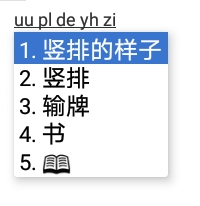
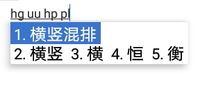
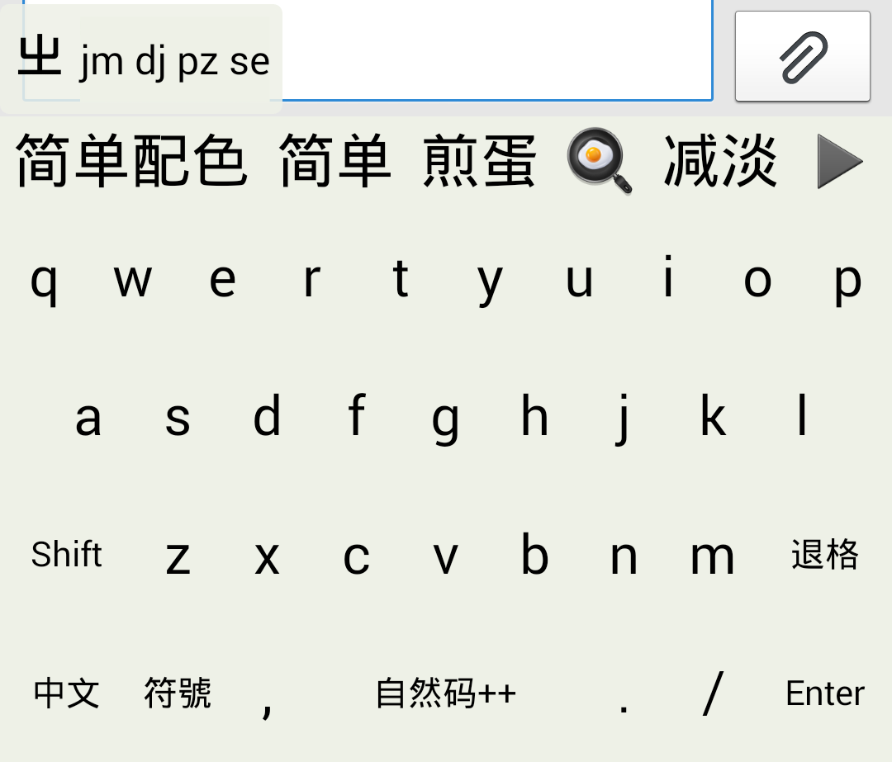
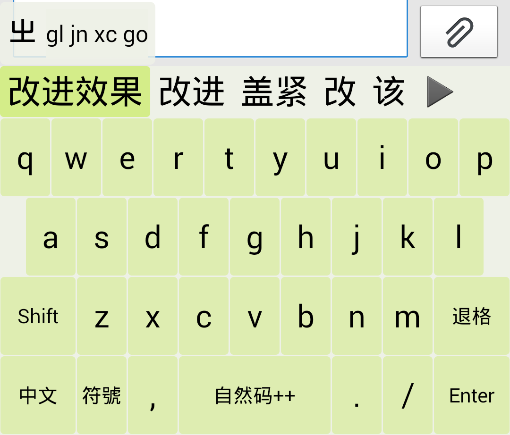
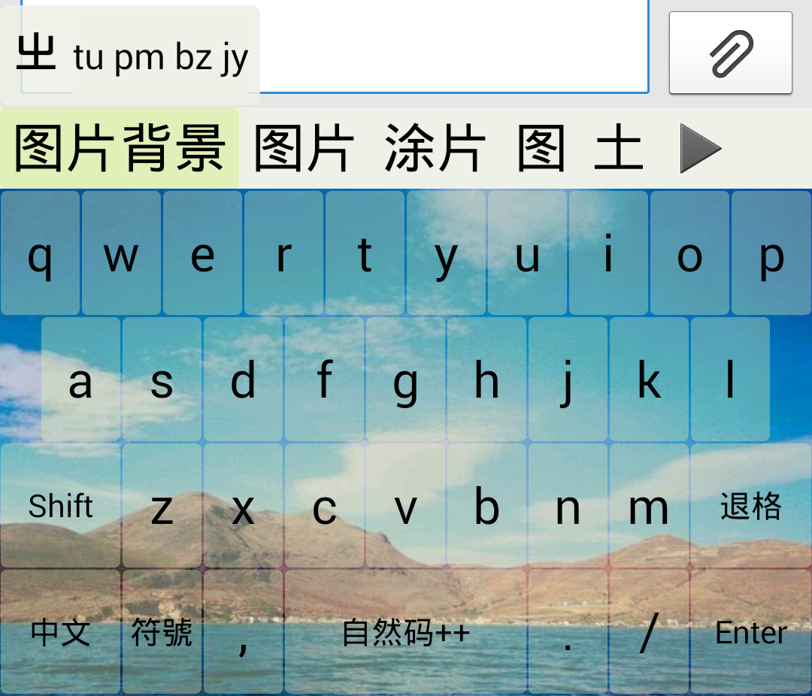
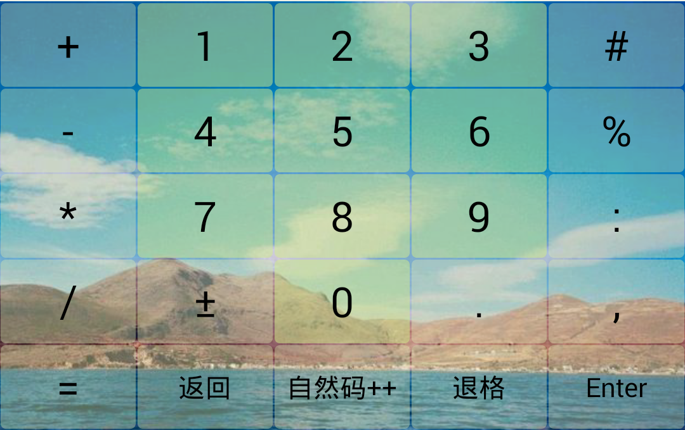

<!--
# `trime.yaml`详解
 -->

基于同文 V3.1.2 20181229 版修订

## 必知必会

您可能需要先了解 YAML 的[基本语法][]。这篇[定制指南][]里有一些实例可以帮助您理解 Rime 的配置方式。另外 Rime 在 YAML 语法的基础上新增了[编译指令][]，想要更灵活地制作同文主题的同学可以参考一下。

[基本语法]: https://github.com/osfans/trime/wiki/trimer小知识(2)---配置文件中的一些yaml语法
[编译指令]: https://github.com/rime/home/wiki/Configuration
[定制指南]: https://github.com/rime/home/wiki/CustomizationGuide#定製指南

### 注解

每个配置条目以“`**[版本号]**`配置名：配置作用简介”或“`配置名`：配置作用简介”的格式呈现。 

**\[版本号\]** 表示此配置项自该版本才可用，**\[~~版本号~~\]** 表示此配置自该版本弃用。**\[不可用\]** 即不确定被弃用的起始版本。

## 一、`style`

界面样式及特色功能

<!-- （xxx）
这些参数已做到图形界面

  - ★`color_scheme`: 当前配色方案的ID
  - ★`destroy_on_quit`: 离开时清理缓存 （`true`:切换到其它输入法时，退出缓存；`false`:不退出缓存，可以加快下次打开的速度）
  - ★`display_tray_icon`: 状态栏图标（`true`:在手机顶部的状态栏中显示同文输入法图标；`false`:不显示）
  - ★`inline_preedit`: 嵌入模式（`preview`:将首位候选嵌入文本框；`composition`:将编码区嵌入到文本框；`input`:将输入码嵌入文本框；`none`:不嵌入）
  - ★`key_sound`: 按键声音 （`true`: 打开；`false`: 关闭）
  - ★`key_sound_volume`: 按键音量
  - ★`key_vibrate`: 按键振动 （`true`: 打开；`false`: 关闭）
  - ★`key_vibrate_duration`: 按键振动时长（=强度），单位：毫秒（>0时振动，否则关闭）
  - ★`longpress_timeout`: 长按速度（默认值: `400`，按住按键超过400毫秒即触发`long_click`功能）
  - ★`repeat_interval`: 按键重复速度（空格键、退格键等自动重复间隔：50毫秒即1秒20次）
  - ★`show_preview`: 按键气泡（`true`: 显示；`false`: 不显示）
  - ★`show_window`: 显示悬浮窗口（`true`: 显示；`false`: 不显示）
  - ★`soft_cursor`: 编码区插入符号「‸」（`true`: 显示；`false`: 不显示）
  - ★`speak_commit`: 朗读上屏文本（`true`: 朗读上屏的文本；`false`: 不朗读）
  - ★`speak_key`: 朗读按键（`true`: 朗读按下的按键名；`false`: 不朗读）
    -->

### 1. 功能

- `auto_caps`: 自动句首大写（`true`:打开;`false`:关闭;`ascii`:仅英文模式句首大写）
- `candidate_use_cursor`: 候选焦点高亮（`true`:打开;`false`:关闭）
- `comment_on_top`: 候选项注释在上方或右侧 （`true`:在上方；`false`:在右侧）
- `horizontal`： 水平模式。改变方向键的功能 （`true`：方向键适配横排候选；`false`：方向键适配竖排候选）
- `keyboards`: 键盘配置。除主键盘外，其它需要用到的键盘都要在这里声明。
- `proximity_correction`: 将按键之间的空白区域分配给相邻的按键，避免空按（`true`:打开；`false`:关闭）
- **\[3.2.3\]**`background_folder`：背景图路径，即保存在 background 的哪个子目录。 使用此参数可以方便管理多个主题的图片（当然也可以指定多个主题共用一套图片）。
- `reset_ascii_mode`: 不同进程中显示键盘时重置为中文状态（`true`:重置为中文；`false`:记忆中英状态）
- `latin_locale`: 在英文状态（ascii_mode）下，朗读按键时所用的语言。
- `locale`: 在中文状态下，朗读上屏文本和按键时所用的语言。  
  ※ 需要先在同文设置界面开启朗读功能。朗读功能还需要手机的 TTS 引擎支持。可使用系统默认引擎，也可安装讯飞语记等第三方引擎。`latin_local`和`local`可以设置的语言也取决于 TTS 引擎。常见的语言：`zh_TW`, `zh_CN`, `zh_HK`, `en_US`, `ja_JP`, `ko_KR`,……
- **\[语音识别几乎不可用\]**`speech_opencc_config`: 语音输入简繁转换（默认值`s2t.json`: 将语音识别的结果转换成繁体再上屏）  
  需要配合 OpenCC 组件来使用。转换的选项有：
  - `s2t.json` #简体 → 繁体
  - `t2s.json` #繁体 → 简体
  - `s2hk.json` #简体 → 香港繁体
  - `hk2s.json` #香港繁体 → 简体
  - `s2tw.json` #简体 → 台湾繁体
  - `s2twp.json` #简体 → 台湾繁体，并转换常用词汇（网络 → 網路）
  - `tw2s.json` #台湾繁体 → 简体
  - `tw2sp.json` #台湾繁体 → 简体，并转换常用词汇（作業系統 → 操作系统）
  - `t2hk.json` #OpenCC 标准繁体 → 香港繁体
  - `t2tw.json` #OpenCC 标准繁体 → 台湾繁体
  - 如果不需要转换，想让语音引擎按原样输出，可设为`none`。(2017-9-13 开始，也可以直接注释掉)  
    ⚠ 同文输入法的语音输入依赖的是手机的「语音识别服务」，而且必须安装「讯飞语记」或者「讯飞语音+」才能使用。

#### 示例：开启英文模式句首自动大写

```yaml
# trime.custom.yaml
patch:
  "style/auto_caps": ascii
```

#### 示例：在预设 26 键键盘上添加语音输入键

```yaml
# trime.custom.yaml
patch:
  "preset_keyboards/qwerty/keys/@31/click": VOICE_ASSIST #将原来的符号键替换为语音键
```

※ 对于默认主题`trime.yaml`，修改的时候需要打补丁。对于自制的主题，一般不需要打补丁。  
 上例若直接修改主题文件，是这样做的：  
 查找按键布局`qwerty`，  
 将按键`{click: Keyboard_symbols, long_click: Keyboard_number}`
修改成`{click: VOICE_ASSIST, long_click: Keyboard_number}`

### 2. 字体


- `text_font`: 编码字体
- `label_font`: 悬浮窗候选项序号字体
- `candidate_font`: 候选字体
- `comment_font`: 候选注释字体
- `hanb_font`: 后备字体。用于补充候选字体（`candidate_font`）。  
  ※ 某些特殊符号，或者很多生僻字（比如 Unicode Ext-B~Ext-F 的字符）在大多数手机上通常都会显示成方框或空白。`hanb_font`可以使这些字符在同文输入法里正常显示（推荐使用[花园明朝](https://zh.osdn.net/projects/hanazono-font/releases/)B 字体：HanaMinB.ttf）。您也可以直接在系统中设置 fallback 字体（全局生效，但需要 root）。
- `latin_font`: 候选及候选注释拉丁字体（暂时对悬浮窗候选无效）  
  ※ 当`latin_font`生效时，拉丁字符（\< 0x2e80）就不再由`comment_font`和`candidate_font`控制
- `key_font`: 按键字体（click）
- `symbol_font`: 符号字体（long_click 和 hint）
- `preview_font`: 按键气泡字体

### 3. 尺寸

- `text_size`: 编码大小
- `label_text_size`: 悬浮窗候选项序号大小
- `candidate_padding`: 候选项内边距（影响候选项的间距）
- `candidate_spacing`: 候选分割线宽度
- `candidate_text_size`: 候选字大小
- `candidate_view_height`: 候选区高度
- `comment_text_size`: 候选注释大小
- `comment_height`: 候选注释区高度
- `key_height`: 键高\*
- `key_width`: 键宽\*，占屏幕宽的百分比  
  ⚠ 当按键布局中的`height`与`width`省略不写时，此处设置的`key_height`与`key_width`才会生效。
- `key_text_size`: 按键文本大小（click）
- `key_long_text_size`: 按键长文本大小（字数 ≥2）
- `symbol_text_size`: 符号大小（long_click 和 hint）
- `round_corner`: 按键圆角半径
- `preview_height`: 按键气泡高度
- `preview_offset`: 按键气泡纵向偏移（默认值`-12`，向下偏移为正，向上偏移为负）
- `preview_text_size`: 按键气泡字体大小
- `shadow_radius`: 键盘字体阴影大小（数值不宜过大，可能会造成卡顿）
- `horizontal_gap`: 键水平间距
- `vertical_gap`: 键盘行距  
  ⚠ 若关闭了`proximity_correction`，过大的`horizontal_gap`与`vertical_gap`会引起空按漏按
- `vertical_correction`: 触摸位置校正（竖直方向）。  
  ※ 为了提升打字手感，可将按键的实际触摸位置相对其显示位置上下偏移一点点（默认值`-10`，上偏为正，下偏为负，为`0`则不偏移）。
- **\[3.2.3\]**`keyboard_padding`: 竖屏模式下，屏幕左右两侧与键盘的距离（减少曲面屏误触）
- **\[3.2.3\]\[不可用\]**`keyboard_padding_left`: 竖屏屏模式下，左手键盘布局，屏幕左侧与键盘的距离
- **\[3.2.3\]\[不可用\]**`keyboard_padding_right`: 竖屏屏模式下，左手键盘布局，屏幕右侧与键盘的距离
- **\[3.2.3\]**`keyboard_padding_bottom`: 竖屏模式下，屏幕下边缘与键盘的距离（减少全面屏误触）
- **\[3.2.3\]**`keyboard_padding_land`: 横屏模式下，屏幕左右两侧与键盘的距离（避免横屏按键过度拉伸变形）
- **\[3.2.3\]**`keyboard_padding_land_bottom`: 横屏模式下，屏幕下边缘与键盘的距离
- **\[3.2.6\]**`keyboard_height`: 键盘锁定的高度。当每行按键高度、行之间间距之和与此参数存在差异时，键盘自动缩放为锁定的高度。使用此参数可以快速调整键盘高度而无需复杂。当缺少此参数时，键盘高度不做缩放计算。
- **\[3.2.6\]**`keyboard_height_land`: 横屏下键盘锁定的高度，同上

#### 示例：更改字体

① 在 rime 文件夹内新建 fonts 文件夹  
 ⚠ fonts 文件夹建在共享文件夹与用户文件夹皆可（若共享文件夹存在 fonts，则字体放在用户文件夹内无效）

② 将字体文件复制到 fonts 文件夹  
 　本例用到了两个字体文件：  
 　　:page_facing_up: gunplay.ttf  
 　　:page_facing_up: 方正行楷简体.ttf

③ 配置字体参数:

```yaml
# trime.custom.yaml
patch:
  "style/candidate_font": 方正行楷简体.ttf #候选字体
  "style/key_font": 方正行楷简体.ttf #按键字体
  "style/text_font": gunplay.ttf #编码字体
  "style/comment_font": gunplay.ttf #候选注释字体
  "style/symbol_font": gunplay.ttf #符号字体
  "style/candidate_text_size": 28 #候选字体大小
  "style/candidate_view_height": 32 #候选区高度
  "style/comment_height": 16 #候选注释区高度
  "style/comment_text_size": 13 #候选注释字体大小
  "style/key_text_size": 24 #按键字体大小
  "style/round_corner": 0.0 #按键圆角大小
  "style/symbol_text_size": 9 #符号字体大小
  #  "style/text_height": 24 #编码区高度（新版已经取消此参数）
  "style/text_size": 18 #编码字体大小
```

效果图：  
 

#### 示例：局部尺寸微调

`style`里的尺寸是全局生效的。实际上我们也可以对某些局部的尺寸做微调。

可以在键盘布局里微调的尺寸：  
 • `horizontal_gap`: 键水平间距  
 • `vertical_gap`: 键盘行距  
 • `round_corner`: 按键圆角（对整个键盘生效）

可以在按键里微调的尺寸：  
 • `key_text_size`: 按键文本（对长标签也生效，不区分按键文本的长短）  
 • `symbol_text_size`: 符号（long_click 和 hint）  
 • `round_corner`: 按键圆角（对单个按键生效）

另外，按键字符的偏移量也是可以局部微调的，详见后面 preset_keyboards。

例 1：调整预设 26 键键盘布局的水平间距和圆角

```yaml
# trime.custom.yaml
patch:
  "preset_keyboards/qwerty/horizontal_gap": 0 #水平间距改为0
  "preset_keyboards/qwerty/round_corner": 0 #按键圆角改为0
  #以上更改仅对布局ID为qwerty的26键键盘生效
```

例 2：单独修改预设 26 键键盘布局中的空格键

```yaml
# trime.custom.yaml
patch:
  "preset_keyboards/qwerty/keys/@33/key_text_size": 12 #空格键字体改小
  "preset_keyboards/qwerty/keys/@33/round_corner": 32 #圆角增大
```

※上例若直接修改主题文件，是这样写的：  
 `{click: space, key_text_size: 12, round_corner: 32, width: 30}`

### 4.悬浮窗口

- `layout`: 悬浮窗口设置
  - `position`: 悬浮窗位置
    - `left`|`right`|`left_up`|`right_up` 这几种都可以让悬浮窗口动态跟随光标（需要 ≥Android5.0）
    - `fixed`|`bottom_left`|`bottom_right`|`top_left`|`top_right` 这几种是固定在屏幕的边角上
  - `min_length`: 悬浮窗最小词长（候选词长大于等于`min_length`才会进入悬浮窗）
  - `max_length`: 连续排列的多个候选项总字数（包括候选项注释）超过`max_length`时，把超出的候选项移到下一行显示（单个候选项若超长，或者`max_length`数值过大，则由`max_width`决定是否换行）
  - `sticky_lines`: 固顶行数（不与其它候选同排，单独一行显示的候选项个数）
  - `max_entries`: 最大词条数（允许进入悬浮窗的最大词条数）
  - `all_phrases`: 显示所有长词。所有满足`min_length`的词条都显示在悬浮窗（一般只用于 table translator，有可能会改变候选项的显示顺序）
  - `border`: 边框宽度（增大边框则向内加粗，也会对悬浮窗圆角产生一点影响）
  - `max_width`: 窗口最大宽度（候选超长则自动换行）
  - `min_width`: 最小宽度（悬浮窗的初始宽度）
  - `margin_x`: 水平边距（左右留白大小）
  - `margin_y`: 竖直边距（上下留白大小）
  - `line_spacing`: 候选词的行间距（px）
  - `line_spacing_multiplier`: 候选词的行间距倍数
  - `spacing`: 悬浮窗位置上下偏移量（一般上移为正，下移为负，但当`position`设为 top_xxx 时，方向是相反的）
  - `round_corner`: 窗口圆角（同时也会使**候选栏**的高亮候选边框产生圆角）
  - `alpha`: 悬浮窗透明度\*（0x00~0xff。0x00 为全透明）
  - **\[~~3.2.3~~\]**`background`: 悬浮窗背景\*（颜色或图片二选一。比如颜色：0xFFD3FF83；图片：xxx.jpg。图片格式 jpg 与 png 皆可，相应的图片需放置在用户文件夹的 backgrounds 目录下，放在共享文件夹无效
  - `elevation`: 悬浮窗阴影（~~≥Android 5.0~~，同文现已最低支持 Android 5.0）
  - `movable`: 是否可移动窗口，或仅移动一次。可能值：`true`|`false`|`once`
- `window`: #悬浮窗口组件
  - `- {start: "", move: 'ㄓ ', end: ""}`  
    #窗口移动图标。当`movable`设为可移动时，拖动这个图标即可调整悬浮窗的位置。`move`可改为任意符号，`start` `end`为左右修饰符号，若不需要修饰可简化为`{move: 'ㄓ '}`。
  - `- {start: "", composition: "%s", end: "", letter_spacing: 0}`  
    #这个组件用来显示输入的编码。`composition`若去掉则不显示编码区。`letter_spacing`为字符间距，需要 ≥Android5.0。
  - `- {start: "\n", label: "%s.", candidate: "%s", comment: " %s", end: "", sep: " "}`  
    #这个组件用来显示候选项。`start: "\n"`表示这个组件另起一行，`label`候选项序号，`candidate`候选项，`comment`候选项注释，`sep`候选项分隔符。（除`candidate`外，其它都是可选的。比如删掉`label`则不显示候选项序号）  
    ※ 奇技淫巧：当前版本（截止到3.2.13），都不支持在隐藏候选单的情况下（即去掉该组件）让`composition`（即上一个组件）支持换行，所以这里提供一个技巧，如果不想显示候选单，那么只在保留该组件的同时，按需求将除`candidate`以外的值改为空（`""`）或去掉，只将`candidate`后面的`"%s"`改为`"‏"`，注意这里是一个不可见字符，请直接复制，它会保证`candidate`有值但不显示任何东西，这个时候`composition`超长时会自动换行。
  - #~~~~~~~~  
    ※ 另外还可以在悬浮窗内放置普通按键，比如地球拼音的声调键：
  - `- {start: "\n", click: ";", label: " ˉ ", align: center, end: " "}`  
    #`click: ";"` `label: " ˉ "`作用与键盘按键相同。`align`对齐方式，left 左对齐|right 右对齐|center 居中，默认为左对齐可省略不写（align 每行组件只需写一个，也可用于上面的编码与候选）
  - `- {click: "/", label: " ˊ ", end: " "}`  
    #`end: " "`的作用是在按键间形成间隙
  - `- {click: ",", label: " ˇ ", end: " "}`
  - `- {click: "\\", label: " ˋ "}`

#### 示例：自定义悬浮窗

配置几种在平板电脑上的悬浮窗样式：

- 1、横排

```yaml
# trime.custom.yaml
patch:
  "style/horizontal": true
  "style/layout/position": left
  "style/layout/min_length": 1
  "style/layout/max_length": 36
  "style/layout/max_entries": 5
  "style/layout/sticky_lines": 0
  "style/layout/max_width": 930
  "style/layout/margin_x": 0
  "style/layout/margin_y": 0
  "style/layout/border": 0
  "style/layout/round_corner": 3
  "style/layout/elevation": 8
  "style/layout/alpha": 0xff
  "style/layout/line_spacing_multiplier": 1
  "style/window":
    - { label: " %s. ", candidate: "%s " }
```


- 2、竖排  
  把上面补丁的`sticky_lines`改成`5`，水平模式`horizontal`改成`false`。  
  

- 3、横竖混排  
  只需要把上面补丁的`sticky_lines`改成`1`即可。  
  

※ 以上示例中去掉了悬浮窗的`composition`组件，因此需要开启嵌入模式才能在文本框中显示编码。另外，开启悬浮窗后，也可以把底下多余的候选栏关掉（参考附录中的示例）。

### 5. 其它

备用参数，暂无功能

- `background_dim_amount`

- `max_height`

- `min_height`

## 二、`fallback_colors`

后备颜色：配色方案中未定义的颜色，自动从这里推导。

```yaml
candidate_text_color: text_color
comment_text_color: candidate_text_color
border_color: back_color
candidate_separator_color: border_color
hilited_text_color: text_color
hilited_back_color: back_color
hilited_candidate_text_color: hilited_text_color
hilited_candidate_back_color: hilited_back_color
hilited_comment_text_color: comment_text_color
text_back_color: back_color
hilited_key_back_color: hilited_candidate_back_color
hilited_key_text_color: hilited_candidate_text_color
hilited_key_symbol_color: hilited_comment_text_color
hilited_off_key_back_color: hilited_key_back_color
hilited_on_key_back_color: hilited_key_back_color
hilited_off_key_text_color: hilited_key_text_color
hilited_on_key_text_color: hilited_key_text_color
key_back_color: back_color
key_border_color: border_color
key_text_color: candidate_text_color
key_symbol_color: comment_text_color
keyboard_back_color: border_color
label_color: candidate_text_color
off_key_back_color: key_back_color
off_key_text_color: key_text_color
on_key_back_color: hilited_key_back_color
on_key_text_color: hilited_key_text_color
preview_back_color: key_back_color
preview_text_color: key_text_color
shadow_color: border_color
```

## 三、`preset_color_schemes`

预置的配色方案

### 颜色值

同文支持以下几种写法：

- `0xaarrggbb`
- `"#aarrggbb"` （引号不能省略，否则会与注释冲突）
- `0xrrggbb` （省略了 aa，表示完全不透明）
- `"#rrggbb"` （同上）
- `0xaa`
- `red`、`green`、`blue`……

其中 aa 透明度，rr 红，gg 绿， bb 蓝，都是十六进制数值，取值范围 00~ff。

### 配色方案

一个主题中可以有多个配色方案。

- `default`: 配色方案 ID，不可重复

  - `name`: 配色方案名称

  - `author`: 作者信息

  - **\[3.2.5\]**`sound`：预设音效包。3.2.5 新增了按键音效包支持，当切换配色时可以自动切换音效。当配色没有指定音效包时，切换为同文偏好设置-按键效果-按键音效包指定的音效。音效包制作方式参照 [同文按键音效包说明](https://github.com/tumuyan/trime-without-CMake/wiki/%E5%90%8C%E6%96%87%E6%8C%89%E9%94%AE%E9%9F%B3%E6%95%88)

  - **\[3.2.6\]**`dark_scheme`：配色方案如有此参数，即视为明亮模式的配色。当系统切换为暗黑模式后，再次弹出键盘时，自动切换配色方案为`dark_scheme`指定的配色。

  - **\[3.2.6\]**`light_scheme`：与`dark_scheme`相反，一套配色方案中这两个参数只需要出现一个，或者一个都没有。

    ▼ 悬浮窗口

  - `border_color`: 悬浮窗边框

  - `label_color`: 悬浮窗候选项序号  
    ※ 悬浮窗高亮候选项序号与`hilited_candidate_text_color`相同

  - `hilited_text_color`: 高亮编码（一般是位于光标插入点左边的编码）

  - `text_color`: 编码（位于光标插入点右边的编码，或者是拼音类方案中无法正常解析的空码，比如全拼时输入 hau，u 就属于这种）

  - `hilited_back_color`: 高亮编码背景  
    ※ 非高亮的编码背景与`back_color`相同

  - ☆`text_back_color`: 编码区背景 
    ※ **\[3.2.3\]** 支持图片
    ※ **\[3.2.3\]** 仅当`style/layout/background`设置失效时才会起作用（当`background`生效时，`text_back_color`就会失效）

    ▼ 输入面板

    ☆**\[3.2.3\]**`root_background`键盘和候选区的整体背景。

    ▼ 候选项

  - `back_color`: 候选区背景\*

  - ☆**\[3.2.3\]**`candidate_background`：候选区整体背景

  - `hilited_candidate_back_color`: 高亮候选背景（候选项被选中时）

  - `candidate_separator_color`: 候选分割线

  - `candidate_text_color`: 候选文本（包括悬浮窗候选，下同）

  - `hilited_candidate_text_color`: 高亮候选文本

  - `comment_text_color`: 候选项注释

  - `hilited_comment_text_color`: 高亮候选项注释  
    ▼ 键盘

  - ☆`key_back_color`: 按键背景

  - ☆`hilited_key_back_color`: 高亮按键背景（按下按键时）

  - `key_text_color`: 按键文本（click）

  - `hilited_key_text_color`: 高亮按键文本

  - `key_symbol_color`: 按键符号（long_click 和 hint）

  - `hilited_key_symbol_color`: 高亮按键符号

  - `preview_back_color`: 按键气泡背景

  - `preview_text_color`: 按键气泡文本

  - `shadow_color`: 按键文字阴影（阴影半径在`shadow_radius`中设定）

  - ☆`keyboard_back_color`: 键盘背景。即将被 `keyboard_background` 取代。

  - ☆ **\[~3.2.17\]**`keyboard_background`：键盘背景，铺满候选栏和导航栏（如果有）。可设颜色值或图片路径。

  - ☆\[3.2.3\]`liquid_keyboard_background`:liquidKeyboard 的键盘背景

  - ☆\[3.2.3\]`long_text_back_color`: 包含长文本的按键背景（比如剪贴板）

  - `key_border_color`: 按键边框\*(暂无)  
    ▼ 功能键（functional: true）

  - ☆`off_key_back_color`: 功能键背景

  - ☆`hilited_off_key_back_color`: 功能键高亮背景（按下时）

  - `off_key_text_color`: 功能键文本

  - `hilited_off_key_text_color`: 功能键高亮文本  
    ※ 在没有特别指定的时候，功能键的 long_click 和 hint 颜色与普通按键一样

  - ☆`on_key_back_color`: shift 键锁定时背景

  - ☆`hilited_on_key_back_color`: shift 键锁定时的高亮背景（按下时）

  - `on_key_text_color`: shift 键锁定时文本

  - `hilited_on_key_text_color`: shift 键锁定时的高亮文本  
    ※ shift 键锁定时的这四种颜色不会因为`functional: false`而失效

  ※ 以上标记为 ☆ 的都可以使用图片作背景（与悬浮窗背景图做法相同）。
  ※ **\[3.2.3\]** 当背景图为.9 图，并且命名为 xxx.9.png 时，图片会按照 .9 图来加载。.9 图体积小，抗拉伸变形，节约内存资源。

#### 示例：制作一个配色方案

有了`fallback_colors`，最少只需要`back_color`和`text_color`就可以做出一个配色方案。

```yaml
# trime.custom.yaml
patch:
  "preset_color_schemes/xxx": #配色方案ID
    name: xxx极简 #配色名称
    back_color: 0xEEF1E7 #背景
    text_color: 0x000000 #文字
```

这是一个用色最少的配色方案。效果是这样：  
   
 ※ 部署完成后，需要从配色菜单中选取刚才添加的配色方案「xxx 极简」，才能看到效果。

试试再加两个颜色：

```yaml
# trime.custom.yaml
patch:
  "preset_color_schemes/xxx": #配色方案ID
    name: xxx极简 #配色名称
    back_color: 0xEEF1E7 #背景
    text_color: 0x000000 #文字
    key_back_color: 0xDEEDB1 #按键背景
    hilited_candidate_back_color: 0xD4ED89 #候选高亮背景
```

好像变得更难看了 😜：  
 

再加个背景图看看：

```yaml
# trime.custom.yaml
patch:
  "preset_color_schemes/xxx": #配色方案ID
    name: xxx极简 #配色名称
    back_color: 0xEEF1E7 #背景
    text_color: 0x000000 #文字
    key_back_color: 0x60DEEDB1 #按键背景加了透明度，不然会挡住图片
    hilited_candidate_back_color: 0x80D4ED89 #候选高亮背景，这个也加了透明度，使颜色减淡一些
    keyboard_back_color: xxx.jpg #图片需放在rime/backgrounds文件夹内
```

最后变成这样：  
 

……  
在每个按键上加图片背景会怎样？您若感兴趣可以试试。

⚠ 图片不需要太大，上例用到的背景图只有 32KB。

#### 示例：局部颜色微调

`preset_color_schemes`里的颜色是全局生效的。同文也提供了一些方法可以对某些局部的颜色做微调。

可以在键盘布局里微调的颜色：  
 • ☆`keyboard_back_color`: 键盘背景

可以在按键里微调的颜色：  
 • ☆`key_back_color`: 按键背景（对功能键也有效，下同）  
 • ☆`hilited_key_back_color`: 高亮按键背景（按下按键时）  
 • `key_text_color`: 按键文本（click）  
 • `hilited_key_text_color`: 高亮按键文本  
 • `key_symbol_color`: 按键符号（long_click 和 hint）  
 • `hilited_key_symbol_color`: 高亮按键符号  
 ※ 除了颜色值和图片，在按键里还可以使用分组颜色标签，详见下面例 2、例 3。  
 ※ 若在键盘里调整功能键颜色，则不区分是否锁定。

例 1：修改预设 26 键键盘回车键的颜色

```yaml
# trime.custom.yaml
patch:
  "preset_keyboards/qwerty/keys/@36/key_back_color": 0xFFAE00
```

※ 上例中，我们给预设 26 键键盘的回车键分配了一个颜色值。这样的话，不管您切换到哪个配色方案，回车键的颜色都固定是`0xFFAE00`。  
若您想更灵活地更改一个按键的颜色，就需要用到分组颜色标签。

例 2：使用分组标签定义按键颜色

先来看一个简单的例子：

```yaml
# trime.custom.yaml
patch:
  "preset_keyboards/qwerty/keys/@15/key_back_color": off_key_back_color
  "preset_keyboards/qwerty/keys/@15/hilited_key_back_color": hilited_off_key_back_color
```

`off_key_back_color`和`hilited_off_key_back_color`是同文默认的功能键颜色标签。在这个补丁中，我们给`qwerty`键盘的`g`键添加了功能键的颜色标签。这样不管切换到什么配色方案，`g`键的颜色总会跟功能键保持一致。

除了使用默认的标签，我们还可以定义自己的颜色标签。

例 3： 自定义分组标签

现在我们要改变数字键盘的数字键颜色，以便快速地与普通按键作区分。

```yaml
# trime.custom.yaml
patch:
  #步骤一，在数字键盘的数字键中添加分组颜色标签
  "preset_keyboards/number":
    name: 預設數字
    author: "osfans <waxaca@163.com>"
    width: 20
    height: 44
    keys:
      - { click: "+" }
      - { click: "1", key_back_color: k_n_b, hilited_key_back_color: h_k_n_b }
      #k_n_b是自定义的标签名，你可以理解成是key_num_back_color的缩写...
      - { click: "2", key_back_color: k_n_b, hilited_key_back_color: h_k_n_b }
      - { click: "3", key_back_color: k_n_b, hilited_key_back_color: h_k_n_b }
      - { click: "#" }
      - { click: "-" }
      - { click: "4", key_back_color: k_n_b, hilited_key_back_color: h_k_n_b }
      - { click: "5", key_back_color: k_n_b, hilited_key_back_color: h_k_n_b }
      - { click: "6", key_back_color: k_n_b, hilited_key_back_color: h_k_n_b }
      - { click: "%" }
      - { click: "*" }
      - { click: "7", key_back_color: k_n_b, hilited_key_back_color: h_k_n_b }
      - { click: "8", key_back_color: k_n_b, hilited_key_back_color: h_k_n_b }
      - { click: "9", key_back_color: k_n_b, hilited_key_back_color: h_k_n_b }
      - { click: ":" }
      - { click: "/" }
      - { click: "±" }
      - { click: "0", key_back_color: k_n_b, hilited_key_back_color: h_k_n_b }
      - { click: "." }
      - { click: "," }
      - { click: "=" }
      - { click: Keyboard_default, long_click: Keyboard_symbols }
      - { click: space }
      - { click: BackSpace }
      - { click: Return }
  #步骤二，在配色方案中定义k_n_b和h_k_n_b的颜色
  "preset_color_schemes/xxx": #配色方案，直接利用了上一节示例做的配色
    name: xxx极简
    back_color: 0xEEF1E7
    text_color: 0x000000
    key_back_color: 0x60DEEDB1
    hilited_candidate_back_color: 0x80D4ED89
    keyboard_back_color: xxx.jpg
    k_n_b: 0x80D4ED89 #数字键背景色
    h_k_n_b: 0x60DEEDB1 #高亮数字键背景色
```

好了，看看效果：  
 

※自定义的分组标签可以在当前主题的所有配色方案中使用。只需要在相应的配色方案中给`k_n_b`和`h_k_n_b`设定颜色值即可。这样每个配色方案中的数字键都可以独立设置颜色，自由度更高。（若某个配色方案中的`k_n_b`省略不写，则数字键的背景色会默认使用普通按键背景色，不用担心会出错。）

分组标签的使用还可以更灵活。

例 4： 分组标签与`fallback_colors`配合

细心的你可能会发现，例 3 中的数字键颜色，只是把普通按键的背景与高亮背景翻转过来而已。像这样很有规律的对应关系，使用`fallback_colors`会更简单。

#将这两句添加到例 3 的补丁中（在`fallback_colors`中建立自定义分组与普通按键的对应关系）

```yaml
"fallback_colors/k_n_b": hilited_key_back_color #使数字键的背景色=普通按键的高亮色
"fallback_colors/h_k_n_b": key_back_color #使数字键的高亮色=普通按键的背景色
```

#再删掉配色方案中的这两句（配色方案中的`k_n_b`和`h_k_n_b`可有可无，若存在则优先使用）

```yaml
k_n_b: 0x80D4ED89 #数字键背景色
h_k_n_b: 0x60DEEDB1 #高亮数字键背景色
```

这样就进一步简化了配色方案。

咦，怎么感觉绕来绕去的，为什么不直接在键盘上写`{click: '1', key_back_color: hilited_key_back_color, hilited_key_back_color: key_back_color}`呢？其实这样写也可以，例 2 就是这样做的。  
例 4 是综合了例 2、例 3 的优点。在`fallback_colors`中建立对应关系，可以简化配色方案，另外还给配色方案单独控制数字键颜色预留了一个通道，可以实现更多的可能。

（若您的主题中只有一个配色方案，那基本上不需要这些复杂的方法）

## 四、`android_keys`

这一部分列出了所有已知的按键以及各种可用的条件、功能。

- `when`: 按键功能的各种触发条件

  - `ascii`: 西文标签（处于英文状态时）
  - `paging`: 翻页标签（翻页时）
  - `has_menu`: 菜单标签（出现候选项时——非空码时）
  - `composing`: 输入状态标签（处于输入过程中）
  - #`always`: 始终
  - #`hover`: 滑过
  - `click`: 单击
  - `long_click`: 长按
  - `combo`: 并击
  - #`double_click`: 双击
  - `swipe_left`: 左滑
  - `swipe_right`: 右滑
  - `swipe_up`: 上滑
  - `swipe_down`: 下滑  
    ※️ 标注#的暂未实现。

- `property`: 各种属性

  - `width`: 宽度
  - `height`: 高度
  - #`gap`: 间隔
  - `preview`: 按键气泡提示
  - `hint`: 按键助记（用于显示双拼的韵母等，通常显示在按键字符下方）
  - `label`: 按键标签 特别的：当按键为符号键，且输入模式为英文或英文标点时，此设置无效
  - **\[3.2.6\]**`label_symbol`: 按键的符号标签（通常显示在按键字符上方，当缺少此参数时，显示 long_click 指定的预设按键的的 label）
  - `states`: 状态标签（用于切换开关的状态）
  - `repeatable`: 长按重复
  - `functional`: 功能键
  - `shift_lock`: Shift、Ctrl、Alt、Meta 等修饰键的锁定方式（click：单击锁定，可用于「选择」键；long：长按锁定；ascii_long：仅英文状态长按锁定）

- `action`: 执行的动作

  - `command`: 执行命令。目前内建支持的值包含：`liquid_keyboard paste_by_char broadcast clipboard date commit run share_text`,其他值会作为 Intent 处理
  - `option`: 命令参数
  - `select`: 选择（键盘布局）
  - `toggle`: 切换状态
  - `send`: 发送按键
  - `text`: 组合键 （用于输出各种组合键）
  - `commit`: 直接上屏 （用于输出各种网址邮箱等）

  ※`when` `name`的用法可参考[按键功能组合示例](#按键功能组合示例)。  
  ※其它参数的用法可参考默认的`trime.yaml`。

`android_keys`目前的主要作用是供定义`preset_keys`和`preset_keyboards`时**查阅**，目前已经基本不生效。用户自定义的主题可直接导入默认主题的对应节点：

```yaml
#xxx.trime.yaml
android_keys:
  __include: trime:/android_keys #导入trime.yaml中的android_keys
```

## 五、`preset_keys`

按键预定义。在这里对功能键进行添加、删除、重定义等操作。

※️ 默认`trime.yaml`的`preset_keys`预置了一些功能键（比如语音输入、撤销&重做、切换键盘、运行程序、搜索字符串等等），在定制键盘布局时需要到这里查阅（`trime.yaml`内有详细的注释，这里不再赘述）。

#### 示例：调整按键属性

例 1：更改回车键标签

在`trime.yaml`中，回车键默认是这样定义的：

```yaml
Return: { label: Enter, send: Return }
```

展开来是这样：

```yaml
Return:
  label: Enter
  send: Return
```

由`label: Enter`可知：回车键默认显示的标签是`Enter`。

如果要把回车键显示成`回车`，可以这样：

```yaml
# trime.custom.yaml
patch:
  "preset_keys/Return":
    label: "回车"
    send: Return
```

例 2：更改空格键的按键气泡提示

如果输入方案的名字很长，空格键的按键气泡也会非常长。可以通过定义空格键的`preview`属性来解决这个问题。

对于一般的按键：

- 如果没有设置`preview`，那么同文会以按键的标签`label`来做按键气泡提示。
- 如果也没有设置`label`，那么会以按键所执行的命令及其相关的状态来做气泡提示。（对于空格键来说，会使用输入方案的名字）。

默认的空格键是这样：

```yaml
space: { repeatable: true, functional: false, send: space }
```

我们给它添加一个`preview`属性

```yaml
# trime.custom.yaml
patch:
  "preset_keys/space":
    repeatable: true
    functional: false
    preview: " " #把空格键的气泡提示设为空格
    send: space
```

例 3：一键输出「日期+时间」

以预设 26 键键盘为例：

```yaml
# trime.custom.yaml
patch:
  # 参考trime.yaml内置的date键，新建一个按键date_time
  "preset_keys/date_time":
    command: date
    label: time
    option: "yyyy-MM-dd  HH:mm:ss" #通过`option`参数控制输出的日期和时间格式
    send: function

  # 用data_time替换原预设26键键盘中的time
  "preset_keyboards/qwerty/keys/@26/long_click": date_time
```

※ 常用的时间选项：`y`年，`M`月，`d`日，`h`时（12 小时制），`H`时（24 小时制），`m`分，`s`秒，`S`毫秒，`E`星期，`D`一年中的第几天，`w`一年中第几个星期，`a`上午/下午，`z`时区

例 4：关闭功能键属性

在`preset_keys`里面定义的按键，默认会打开`functional`属性。这些按键在键盘上会显示出功能键特有的颜色（比如回车键和退格键）。  
假设要让回车键也变为普通按键的颜色，可以关闭它的`functional`属性（关闭后只会改变功能键的颜色，其它功能不会有变化）

```yaml
# trime.custom.yaml
patch:
  "preset_keys/Return":
    functional: false #不使用功能键颜色
    label: Enter
    send: Return
```

例 5: 自定义组合键

使用`text`可以实现一些比较复杂的操作  
比如：

```yaml
overwrite: { text: "{Control+a}{Control+v}", label: 覆盖 }
```

这个组合键把全选和粘贴合并起来了。按下它就可以用剪贴板中的内容覆盖当前文档。

`text`的格式：`text: "{send|key}{send|key}……"` （功能键必须用大括号`{}`括起来，其它的文本或符号可以省略括号。※组合键需要加引号，以免出现语法错误。）

`text`的其它用例：

- `text: "{Escape}{/fh}"`：清空前面的输入码并输入`/fh` （配合 symbols.yaml 可以输入符号）
- `text: "「」{Left}{Keyboard_default}"`：输出成对符号`「」`并把光标移到符号中间再返回主键盘
- `text: "{Control+Left}"`：逐词移动。（单个组合键也可以直接用`send: Control+Left`，`text`可以看作是组合键的组合）
- ...

可以自由发挥想象力，看看你造出来的组合键同文能不能支持。

例 6: **\[3.2.6\]** 简写

特别的，keyboard 中允许一定程度的简写，从而减少 presetkey 的数量。

```
 - {click: f, swipe_up: {commit: "%"}}
```

## 六、`preset_keyboards`

预置的键盘布局。

### 键盘布局

一个主题里可以有多个键盘布局。

`default` 键盘布局 ID，不可重复

- `name`: 布局名称
- `author`: 作者信息
- `ascii_mode`: 键盘的默认状态（`0`：中文；`1`：英文）
- `ascii_keyboard`: 非标准键盘（比如注音、仓颉、双键等），在切换到英文模式时，自动跳转到这里设定的英文键盘（试验功能，有待完善）
- `reset_ascii_mode`: 切换键盘、重新弹出键盘时，是否重置到当前 keyboard 指定的 ascii_mode 描述的状态（默认 false）。与`style/reset_ascii_mode`(指定弹出键盘时是否重置 ASCII 状态）配合使用。
- `label_transform`: 中文模式下按键字母标签自动大写（`uppercase`：自动大写，仅对单个字母生效，长标签请直接更改 label；`none`：无，可省略不写）
- `lock`: 在不同程序中切换时锁住当前键盘，不返回默认的主键盘。用于单手键盘等。（`true`：锁住；`false`：不锁，可省略不写）
- `columns`: 键盘最大列数，超过则自动换行，默认 30 列。
- `width`: 按键默认宽度（也可以在按键里面单独定义某个按键的宽度）
- `height`: 每行的高度（要想改变单独一行的高度，可以直接在那一行行首的按键里设`height`）
- **\[3.2.6\]**`auto_height_index`: 当使用`style/keyboard_height`参数锁定键盘高度时，由于像素只能取整数，如果缩放产生了余数，哪一行吸收缩放后的余数。第一行即 0，第二行为 1，以此类推；特别的，当值为负数时，为倒序序号（-1 即倒数第一个）;当值大于按键行数时，为最后一行。
- **\[3.2.6\]**`keyboard_height`: 键盘锁定的高度。当 style 中锁定键盘高度时，如 preset_keyboard 再次指定键盘高度，则当前键盘以此为准
- **\[3.2.6\]**`keyboard_height_land`: 横屏下键盘锁定的高度，同上
- `key_hint_offset_x`: 助记符号 x 方向偏移量（向右为正，下同）
- `key_hint_offset_y`: 助记符号 y 方向偏移量（向下为正，下同）
- `key_symbol_offset_x`: 长按符号 x 方向偏移量
- `key_symbol_offset_y`: 长按符号 y 方向偏移量
- `key_text_offset_x`: 按键文本 x 方向偏移量
- `key_text_offset_y`: 按键文本 y 方向偏移量
- `key_press_offset_x`：按键按下时所有文本 x 方向偏移量
- `key_press_offset_y`：按键按下时所有文本 y 方向偏移量  
  ※以上这几个 offset 也可以直接写在按键中，仅对该按键生效。
- `keys`: 按键排列顺序  
  键盘中每对{}括号代表一个按键，按从左到右、从上到下的顺序排列。每行的宽度排满`100`或虽然不足`100`但无法再容纳一个按键又或者每行按键数量达到`columns`的设定值时，转到下一行继续排列。

### 布局调用

`trime.yaml`已经内置了很多种键盘布局，一般常用的输入方案都可以自动匹配到合适的预置键盘。  
※️`style/keyboards`中的`.default`，就是用来自动匹配键盘布局的。

自动匹配的过程：

- 如果输入方案的`schema_id`可以找到对应的键盘布局`ID`，则直接使用这个布局  
  比如仓颉五代的`schema_id`是`cangjie5`，在`trime.yaml`中刚好有`ID`为`cangjie5`的键盘布局，那就直接使用它。
- 如果匹配不了`ID`，那根据输入方案的`speller/alphabet`所用的字符，匹配最合适的布局方案  
  比如朙月拼音的`speller/alphabet`是`zyxwvutsrqponmlkjihgfedcba`，恰好使用了 26 个英文字母。那就自动套用`预设26键`键盘。
- 如果`ID`和`speller/alphabet`都匹配不到，就用默认的`预设26键`键盘。

如果自动匹配的布局不理想，还可以手动设置。如下面的示例。

#### 示例：指定朙月拼音使用 36 键键盘布局

（36 键键盘比 26 键的多了一排数字键，可以快捷输入数字）

```yaml
# trime.custom.yaml
patch:
  "preset_keyboards/luna_pinyin/import_preset": qwerty0 #预设36键布局的ID是qwerty0
```

如是即可。

再看看，重新部署后，补丁融入`trime.yaml`之中，就被展开成这种格式：

```yaml
luna_pinyin:
  import_preset: qwerty0
```

可以理解成：新建了一个`ID`是`luna_pinyin`的布局，这个布局导入了`qwerty0`的全部设置。

⚠ 如果这里指定的键盘出错了，就会自动调用`default`键盘。

### 布局调整

键盘布局就像积木一样，是由各种功能组合&排列而成。

先来看看按键是怎么由一个个功能组合而成的：

#### 按键功能组合示例

| No. | 按键 | 功能 |
| :-: | :-: | --- |
| 1 | `{click: g}` | 单击时输出`g`，没有其它功能。 |
| 2 | `{width: 5}` | 这是一个宽度为 5 的空白间隙。 |
| 3 | `{click: space, width: 28}` | 单击输出空格，按键加宽（到`28`）。 |
| 4 | `{click: h, long_click: "'"}` | 单击输出`h`，长按输出`‘`撇号。 |
| 5 | `{click: e, label: '水', long_click: '+'}` | 单击输出`e`，在中文状态时按键标签是`水`，英文时标签恢复成`e`，长按输出`+`。用于仓颉键盘。 |
| 6 | `{click: v, long_click: ~, swipe_left: Date, swipe_right: Time}` | 单击输出`v`，长按输出`~`，左滑输出日期，右滑输出时间 。 |
| 7 | `{click: Shift_L, composing: "'", width: 15}` | 平时单击切换大小写，在打字过程中变为分词键`'`。按键加宽到`15`。 |
| 8 | `{click: '.', long_click: '>', has_menu: '次选', send_bindings: false}` | 单击输出`.`，长按输出`>`，打字出现候选时按键标签变为「次选」。⚠ `send_bindings`用来控制`composing`、`has_menu`、`paging`时是否发送按键给后台（`true`：发送；`false`：不发送，仅改变按键标签，按键的实际功能仍是`click`）。`send_bindings`默认为`true`，可以省略不写。 |
| 9 | `{click: '.', long_click: '>', has_menu: Page_Down}` | 平时单击输出句点`.`，长按输出`>`，打字出现候选项时，变为`向下翻页键`。 |
| 10 | `{click: ',', long_click: '<', paging: Page_Up}` | 平时输出`,`，长按输出`<`，翻页时变为`向上翻页键`。 |
| 11 | `{click: "ㅎ" , ascii: g}` | 单击时输出符号“ㅎ”，在英文状态下输出`g` |
| 12 | `{click: "h" , hint: "ang"}` | 单击输出`h`，在按键下方显示韵母`ang`，用于双拼等助记键盘 |
| 13 | `{click: "(){Left}"}` | 单击时输出一对括号`（）`，且光标自动移到括号中间。※与`preset_keys`里面的`text: "(){Left}"`等效，但`text`不能直接用在键盘布局中，要改成`click`、`long_click`等 |
| 14 | `{click: "q" , height: 60}` | 单击时输出`q`，当该键位于行首时，整排按键加高到 60 |
| 15 | `{click: ""}` | 这是一个空按键，按下去不会触发任何动作。空键的其它写法：`click: "VoidSymbol"`，`composing: "VoidSymbol"` |
| 16 | `{click: Return, combo: g}` | 单击时是回车键，与其它按键并击时输出`g`。※`combo`通常用于并击方案，可以复用一些功能键（比如`space`、`Keyboard_number`），节约空间。⚠ 因`combo`与`repeatable`属性有冲突，所以类似退格键这样的按键必须关掉`repeatable`才能使用`combo` |

我们在`android_keys`和`preset_keys`中提及的触发条件和按键，都可以按这种格式{when: name, when: name, when: name, ……}组合起来，还可以加上一部分的`property`（比如`width`和`label`）。基本上就是这样来做组合了。

※️ 如果指定的`name`在`android_keys`和`preset_keys`中都找不到，那就以文本形式直接输出（比如`{click: 你好}`，单击该键时，就直接输出「你好」）。在制作特殊符号键盘时，可能需要这种效果。

按键造好了，再按一定的顺序排列起来就成了布局。

#### 示例：给键盘添加删词功能

对于使用`script_translator`的拼音类输入方案，如果在打错词后，马上按退格键删除已经上屏的错词，可以使错词不被记录到用户词典中。但是如果隔的时间太长，或者使用的是`table_translator`形码方案，那就没办法这样删词了。这时候就需要定制键盘来辅助我们进行删词。

以明月拼音为例，键盘示意图：  


※ 由于用到了`has_menu`条件，键盘右上角的左右方向键和删词键只在正常打字的过程中出现。处于英文状态或不打字时仍然是数字键 8、9、0。

```yaml
# trime.custom.yaml
patch:
  # 1、让朙月拼音使用36键键盘布局
  "preset_keyboards/luna_pinyin/import_preset": qwerty0

  # 2、给36键键盘添加方向键和删词键
  "preset_keyboards/qwerty0/keys/@7/has_menu": Left
  "preset_keyboards/qwerty0/keys/@8/has_menu": Right
  "preset_keyboards/qwerty0/keys/@9/has_menu": DeleteCandidate
```

⚠ 与 PC 版的 Rime 一样，只能从用户词典中删除词组，若要删除固态词典中的词组，请直接修改`dict.yaml`文档。

#### 示例：新建一个副键盘

```yaml
# trime.custom.yaml
patch:
  # 1、新建一个键盘布局xkey
  "preset_keyboards/xkey": #布局ID
    author: "xq" #作者
    name: "数字+操作键" #方便自己辨识的名字
    ascii_mode: 1 #默认进入英文状态
    height: 44 #每行高度
    width: 11 #按键默认宽度（取所有按键中用得较多的宽度值，接下来就可以少写一些width了）
    keys: #按键排列
      # 第一行
      - { click: "#", long_click: cut }
      - { click: "%", long_click: copy }
      - { click: "@", long_click: paste }
      - { click: "+", width: 13 }
      - { click: 7, width: 18 }
      - { click: 8, width: 18 }
      - { click: 9, width: 18 }
      # 第二行
      - { click: Page_Up }
      - { click: Up }
      - { click: Page_Down }
      - { click: "-", width: 13 }
      - { click: 4, width: 18 }
      - { click: 5, width: 18 }
      - { click: 6, width: 18 }
      # 第三行
      - { click: Left }
      - { click: Tab }
      - { click: Right }
      - { click: "×", width: 13 }
      - { click: 1, width: 18 }
      - { click: 2, width: 18 }
      - { click: 3, width: 18 }
      # 第四行
      - { click: Home }
      - { click: Down }
      - { click: End }
      - { click: "÷", width: 13 }
      - { click: ",", width: 18 }
      - { click: 0, width: 18 }
      - { click: BackSpace, width: 18 }
      # 第五行
      - { click: Keyboard_default, long_click: Menu, width: 18 }
      - { click: "±", width: 14.9 } #如果上下的按键没有严格对齐，可以微调宽度
      - { click: "=", width: 13 }
      - { click: space, width: 18 }
      - { click: ., width: 18 }
      - { click: Return, width: 18 }

  # 2、要在主键盘中调用它，就得新建一个功能键，来开启这个ID为xkey的键盘
  "preset_keys/Keyboard_xkey": #按键ID
    label: 123 #按键标签
    send: Eisu_toggle #执行切换键盘命令
    select: xkey #选择xkey键盘

  # 3、把这个切换键盘的功能键放到主键盘中（以预设26键键盘为例）
  "preset_keyboards/qwerty/keys/@31/long_click": Keyboard_xkey #通过长按符号键来开启这个键盘

  # 4、最后在style/keyboards中声明一下我们要用到xkey这个键盘
  "style/keyboards":
    - .default
    - default
    - number
    - symbols
    - xkey #style/keyboards不能只写xkey一个，其它用到的键盘要照原样抄过来，不然会出错
```

副键盘就这样做出来了。效果图：  


⚠ 如果是新建主键盘，则可以省略步骤 2、3、4，因为同文可以根据键盘 ID 自动调用键盘。

## 常见问题：修改不生效？

比较常见的原因是配置文件出现语法错误了，需要检查空格缩进、引号配对、是否错用 tab 等等。哪怕是一个空格出错了，也有可能会使整个配置文件失效，初学者需要格外小心。

仅供参考，欢迎指正。

---

# 附录： `schema.yaml`中的`trime`

还可以针对不同输入方案设置主题参数。

## 1、`style`

在`schema.yaml`里面设置的`style`参数会优先生效。

示例： 为英文输入方案设置专用的英文字体

```yaml
#easy_en.schema.yaml

style:
  candidate_font: gunplay.ttf #相应的字体文件需放在rime/fonts
  comment_font: gunplay.ttf
  #也可以直接设置latin_font，但latin_font暂时对悬浮窗不起作用
```

当切换到 easy_en 方案时，候选栏的字体自动变为 gunplay。（在使用其它输入方案时，仍然使用`trime.yaml`里面设定的字体）

## 2、`switches`

在 schema 里面可以给这些开关设置初始状态：

- `_hide_candidate` 隐藏候选栏
- `_hide_comment` 隐藏候选项注释
- `_hide_key_hint` 隐藏按键下方的助记符号
- **\[3.2.6\]**`_hide_key_symbol` 隐藏按键上方的符号

※ 这几个开关分别对应预设主题中`preset_keys`里的功能键：`Candidate_switch`、`Comment_switch`、`Hint_switch`。

示例： 盲打方案自动关闭候选栏

```yaml
#xxx.schema.yaml

switches:
  - name: _hide_candidate
    reset: 1 #默认开启这个开关，隐藏候选栏
    # 由于没有设置states，这个开关是隐藏的。只在切换到该方案时将_hide_candidate设为1。
```

当切换到这个方案时，候选栏自动关闭。  
※在需要时，也可以通过快捷键或键盘按键随时打开候选栏。

也可以在状态栏上添加按键：

示例： 在状态栏放置按键（试验功能）

`option`格式：

- `_key_`+`按键` （这里的按键可以是功能键、符号、字母、任意文本）
- `_keyboard_`+`键盘布局ID` （一些比较特殊的 id：`.default`返回当前主键盘，`.next`下一个键盘，`.last`在最近使用的两个键盘间轮换，`.last_lock`返回上一个标记为`lock`的键盘）

```yaml
#xxx.schema.yaml

switches:
  # 这个按键用来收起软键盘
  - options: [_key_Hide]
    states: ["▼"]
  #states是显示在状态栏的图标，options是实际执行的功能

  # 这个按键用来调出输入法切换菜单
  - options: [_key_IME_switch]
    states: ["🌐"]
  # 更多功能键请查阅trime.yaml/preset_keys

  # 这是一个空按键，按下去不会执行任何动作
  - options: [_key_VoidSymbol]
    states: ["    "] #空键的宽度由这里的空格决定

  # 这个按键用来输出句号
  - options: [_key_period] #period是句号的英文名，也可以直接写成[ _key_. ]
    states: ["。"]

  # 这个按键用来输出固定的短语
  - options: [_key_吃饭了吗？]
    states: ["🍚"]

  # 这个按键用来切换键盘布局（在主键盘、数字键盘、英文键盘之间轮换）
  - options: [_keyboard_.default, _keyboard_number, _keyboard_letter]
    states: [默认, 123, abc]
  #多个键盘轮换的功能还有一些问题，有待完善

  # 也可以只切换到一个特定的键盘
  - options: [_keyboard_number]
    states: \[123\]

  #...
```
