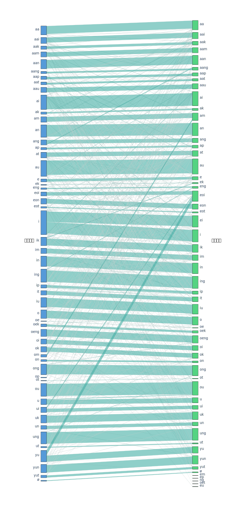
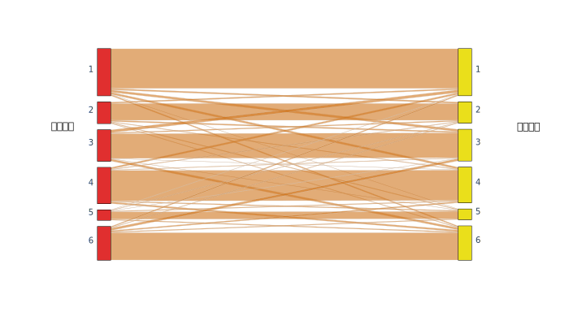
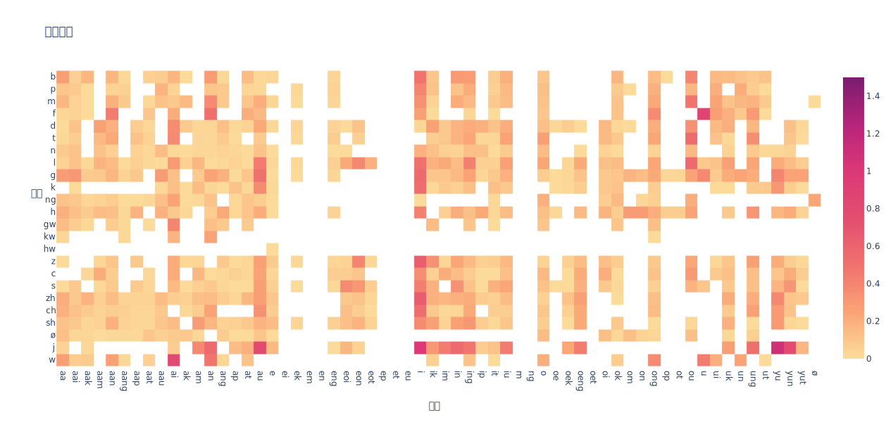
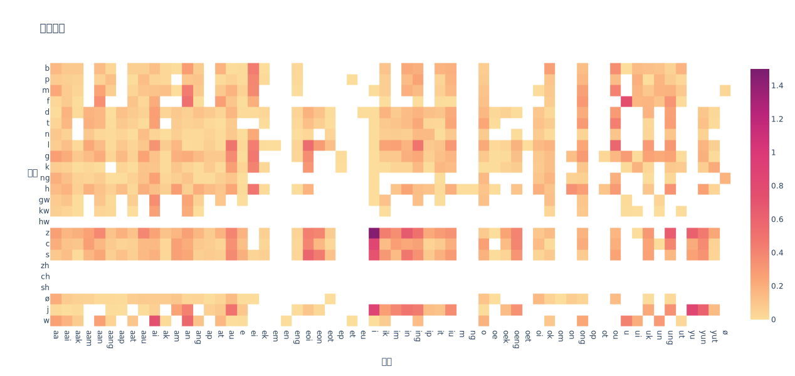

# 清代粵語

## 參攷資料

### 其書

[英華分韻撮要](https://library.umac.mo/ebooks/b31043793.pdf)[^1]是美國人衞三畏所著，1856年出版於廣州。
英華分韻撮要以江湖尺牘分韻撮要合集爲底本，按照英式字典的體例和順序編排，除了粵語讀音之外，在每個字頭上還標註了官話讀音。

<object data="/rime-docs/assets/pdf/英華分韻撮要.pdf" type="application/pdf" width="100%" height="500" >
  <embed src="/rime-docs/assets/pdf/英華分韻撮要.pdf" type="application/pdf" />
</object>

[^1]: 原链接失效，更新为[cyingcwcfanwan00williala.pdf - archive.org](http://www.archive.org/download/cyingcwcfanwan00williala/cyingcwcfanwan00williala.pdf) 

### 記音體例

因原書記音符多爲非`ANSII`字符，且以`'`表示送氣、以角標表音調，閱讀不便。故以粵拼體例爲主，重新記音如下：

>a記爲a，/ə/，讀如：quot<b>a</b>  
á記爲aa，/ɑ/，讀如：f<b>a</b>ther   
e記爲e，/ɛ/，讀如：d<b>ea</b>d，爲ing或ik之口語音   
é記爲e，/e/，讀如：s<b>ay</b>，獨立韻母   
i記爲i，/ɪ/，讀如：f<b>i</b>nish，僅出現於ing、ik   
í記爲i，/i/，讀如：f<b>ee</b>l   
o記爲o，/ɔ/，讀如：l<b>aw</b>   
ò記爲o或ou，/oʊ/，讀如：cr<b>ow</b>，在òm中記爲o，獨用記爲ou   
u記爲u或eo，/ʊ/，讀如：b<b>u</b>ll，在ung、uk中記爲u，在un、ut中記爲eo   
ú記爲u，/u/，讀如：f<b>oo</b>l   
ü記爲yu，/y/，讀如：法語<b>u</b>ne   
ù記爲oe，/ɜ:r/，讀如：t<b>ur</b>n，除靴字外均爲口語音   
éu記爲oe，/ɚ/，讀如：Capharn<b>au</b>m，僅出現於éung、éuk   
ui記爲eoi，/ʊi/，讀如：L<b>oui</b>s   
úi記爲ui，/ui/，讀如：ch<b>ewi</b>ng   
sz、tsz、ts’z記爲si、zi、ci，/ɿ/，讀如普通話兹磁思

## 特點

### 聲母

有`zh`、`ch`、`sh`三組舌葉聲母，其字基本與普通話捲舌音字對應，但亦偶有例外，如：

> 索〔索取〕：`shaak3` / `shok3`，古生母字   
 森：`sham1`，古生母字   
 涔：`sham4`，古崇母字   
 霜：`soeng1`，古生母字   
 師：`si1`，古生母字   
 猜：`chaai1`，古清母字   
 策、冊：`chaak3`，古初母字   
 測、惻：`chak1`，古初母字   
 責：`zhaak3`，古莊母字   
 澤、擇：`zhaak6`，古澄母字   
 仄、側：`zhak1`，古莊母字   

牙音送氣與否發生改變

> 儈、劊、檜、獪、膾、鱠、癐字由`gui`變爲`kui`   
 決、訣、玦、缺、闋、厥、蕨、潏、譎等字由`gyut`變爲`kyut`，僅極少數保留`gyut`的異讀

### 韻母

部份`u`併入`ou`

> `su`全部併入`sou`，如：穌、蘇、甦、酥、訴、素、愫字，皆爲古模韻字   
 `lou`有`lu`異讀，如：魯、櫓、艣、虜、擄、鹵字，皆爲古模韻字

大量`yu`、`ui`併入`eoi`

> `gyu`、`kyu`、`hyu`、 `nyu`、 `lyu`、`zyu`、`cyu`、`syu`變爲`eoi`韻，如：居、區、虚、女、呂、序、趨、須等字，以古魚韻、虞韻字爲主   
* *注：今讀`zyu`、`cyu`、`syu`者皆爲舊讀`zhyu`、`chyu`、`shyu`者*   

> `dui`、`tui`、`lui`、`zui`、`cui`變爲`eoi`韻，如：對、退、雷、罪、催等字，以古灰韻字爲主   
* *注：原亦有讀`leoi`、`zeoi`、`ceoi`、`seoi`者，如：淚、醉、翠、雖，以古脂韻、支韻字爲主*

有`om`韻

> `om`、`hom`、`gom`變爲`am`韻，如暗、勘、甘等字，以古談韻、覃韻爲主   
* *注：原亦有讀`gam`者，如今、金等字，皆爲古侵韻字*

大量`i`韻變爲`ei`韻，而`/ɿ/`則變爲`/i/`

> `bi`、`pi`、`mi`、`fi`、`di`、`ni`、`li`、`hi`韻變爲`ei`韻，如比、皮、未、飛、地、尼、理、氣等字，皆爲古止摄字      
 `zi`、`ci`、`si`三韻由`/tsɿ/`、`/tsʰɿ/`、`/sɿ/`變爲`/tsi/`、`/tsʰi/`、`/si/`，皆爲古止摄字

### 聲調

陽上減少，併入陽去、陰去等調

> 轎由`giu5`變爲`giu6`   
 睽由`kwai5`變爲`kwai1`   
 滲由`sam5`變爲`sam3`

## 統計數據

### 音節數

* 清代粵語
  * 帶調音節數1854個
  * 不帶調733個
  * 聲母24個
  * 韻母53個

* 現代粵語
  * 帶調音節數2316個
  * 不帶調713個
  * 聲母20個
  * 韻母59個

*注：可能因爲英華分韻撮要收字以字書爲本，而現代粵語音統計自Unicode粵語讀音，包含了大量口語音、變異音，因而此對比僅供參攷*

### 字音分散度

分散度以此對比：不帶調各音節字佔比之標準差×不帶調音節數
>* 清代粵語：100.33%
* 現代粵語：105.88%

現代粵語字音分散度略差，因爲三個捲舌聲母消失，且`ui`、`yu`、`eoi`韻部份歸併

### 音節分佈

爲便於展示，聲調未記入下表

---

電子化由[雪齋](https://github.com/LEOYoon-Tsaw "雪齋")完成，可參看[英華分韻撮要文本版](https://github.com/LEOYoon-Tsaw/Rime_collections/blob/master/分韻撮要..txt "分韻撮要")   
甲午年九月初一戊戌
