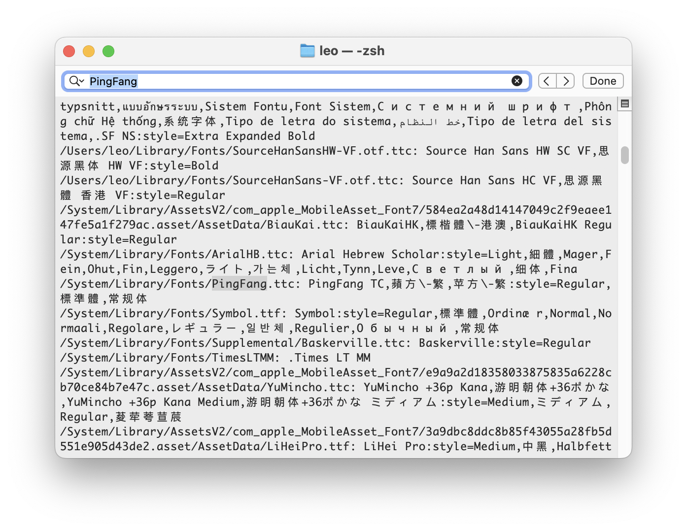

鼠鬚管需要正確的字體名才能識別字體，多餘／缺少空格都會導致字體不能識別，目前也沒有辦法模糊識別。如果您使用中發現字體設置未生效，可參攷以下方法找到正確字體名。

在終端機（Terminal）中輸入：`fc-list`，然後搜索想找的字體，如下圖所示

`蘋方-繁`、`蘋方-繁-Regular`、`蘋方-繁-標準體`、`PingFang TC-Regular`、`PingFang TC`、`PingFang TC-標準體`都可以使用。
`PingFangTC-Regular`也可以但需注意這是字體本名，並非基於以上信息所得，`PingFangTC`不行。

---

Squirrel needs correct font name to load your fonts. Nuance in font names like space matters. To find the correct font name to use, use command `fc-list` in Terminal, then search for your font.

As shown in screenshot above, usable font names are: `PingFang TC-Regular`, `PingFang TC`, `PingFang TC-標準體`, `蘋方-繁`, `蘋方-繁-Regular`, `蘋方-繁-標準體`.
`PingFangTC-Regular` works but it's the code name for the font, which is not shown by the command. Names like `PingFangTC` won't work.