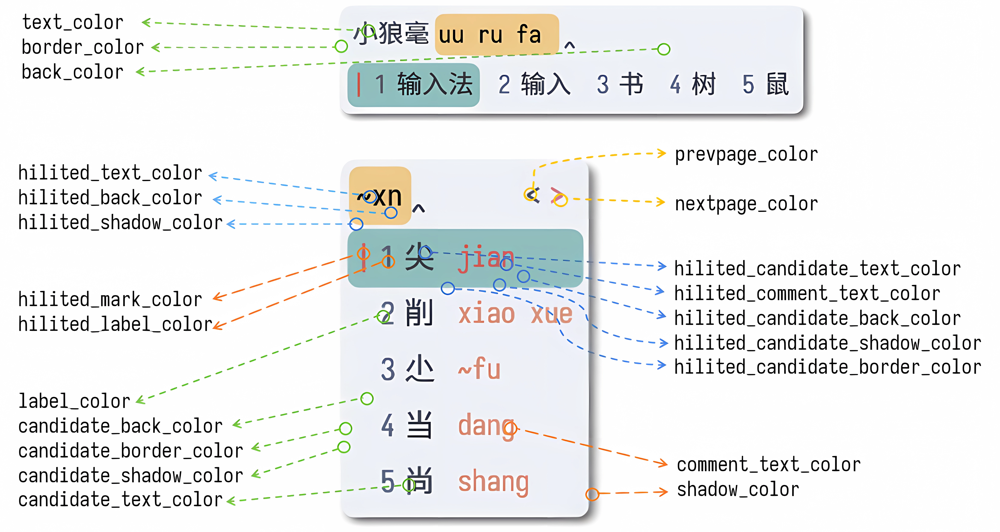

# 定制小狼毫配色

您可以在 `weasel.yaml` 的 `preset_color_schemes` 节点下定制配色方案。

## 图解

下面是一个附有每个条目说明的示例：

```yaml
# weasel.yaml
preset_color_schemes:
  nord:                                     # 在 `style/color_schema` 指定的配色方案值
    name: "远山／Nord"                       # 方案设置中显示的配色名称
    author: Mirtle                           # 配色作者名称
    color_format: rgba                       # 颜色格式：argb（0xaarrggbb）；rgba（0xrrggbbaa）；abgr（0xaabbggrr 默认）
    # 默认配色
    text_color: 0x2E3440                     # 文字
    shadow_color: 0x000000b4                 # 阴影
    label_color: 0x4C566A                    # 标签
    comment_text_color: 0xD08770             # 注释
    border_color: 0xECEFF4                   # 边框
    back_color: 0xECEFF4                     # 背景
    # 候选项配色
    # candidate_back_color: 0xECEFF4         # 背景
    # candidate_border_color:                # 边框
    # candidate_shadow_color:                # 阴影
    # candidate_text_color: 0x2E3440         # 文字
    # 高亮区域配色
    hilited_text_color: 0x000000             # 文字
    hilited_back_color: 0xEBCB8B             # 背景
    # hilited_shadow_color:                  # 阴影
    # 选中的候选区域配色
    hilited_mark_color: 0xBF616A             # 标签前的标记
    hilited_label_color: 0x4C566A            # 标签
    hilited_comment_text_color: 0xBF616A     # 注释
    hilited_candidate_text_color: 0x2E3440   # 文字
    hilited_candidate_border_color: 0x8FBCBB # 边框
    hilited_candidate_back_color: 0x8FBCBB   # 背景
    # hilited_candidate_shadow_color:        # 阴影
    # inline_preedit: false 时翻页箭头颜色，不设置则不显示箭头
    nextpage_color: 0xBF616A                 # 下一页
    prevpage_color: 0x000000                 # 上一页
```

各个选项的含义标注如下：



## 预览配色

您如果需要查看预置配色方案的效果，可以右键小狼毫图标，点击「输入法设定」：


想要在此界面中添加自定义方案的预览图，可以

1. 在小狼毫用户目录新建 preview 文件夹；
2. 为将自定义配色方案创建截图；
3. 将自定义皮肤的截图重命名为 `color_scheme_<scheme_name>.png` 放入此文件夹。

## 配色方案基本信息

```yaml
 nord:
    name: "远山／Nord"
    author: Mirtle
    color_format: rgba
```

- 配色方案第一行需要指定该配色方案的代码名 `nord`，该名称用于在配置文件中代指该方案。

在本例中，如果想将 Weasel 配色方案全局调整为该方案，可以在 `weasel.custom.yaml` 写：

```yaml
# weasel.custom.yaml
patch:
  "style/color_scheme": nord
```

如果想将某个输入方案的配色指定为该方案，例如，将明月拼音（luna_pinyin）的配色指定为 `nord`，可以在 `luna_pinyin.schema.yaml` 添加如下两行：

```yaml
# luna_pinyin.schema.yaml
style:
  color_scheme: nord
```

或者，在 `luna_pinyin.schema.custom.yaml` 添加如下一行：

```yaml
# luna_pinyin.schema.custom.yaml
patch:
  "style/color_scheme": nord 
```

这样，当使用其他输入方案时，小狼毫将使用全局配色方案；当切换到明月拼音时，小狼毫将会使用 `nord` 配色方案。

- `name`、`author` 键指定该配色方案的显示名称和作者。

- `color_format` 指定颜色格式，不指定该值则为默认值 `abgr`，书写方式为 `0xaabbggrr`；支持的所有选项为 `argb`（`0xaarrggbb`）；`rgba`（`0xrrggbbaa`）；`abgr`（`0xaabbggrr`）

## 元素

在小狼毫候选窗口中，如下元素可以在方案中指定配色：

- `text_color`：主要文字，如编码文字，候选文字
- `back_color`：背景
- `shadow_color`：阴影
- `label_color`：候选项之前的标签
- `comment_text_color`：注释文字
- `border_color`：边框

这些元素可以用区域作前缀，组合形成小狼毫所有的支持的配色条目。例如，高亮区域（`hilited_`）的文字（`text_color`）就是 `hilited_text_color`；候选区域（`candidate_`）的背景色（`back_color`）为 `candidate_back_color`。

一些元素在某些区域不存在，因而就不存在这类组合；而另外一些元素只有在特定区域才存在：

- `hilited_mark_color`：选中候选项的标签前的标记，即 `weasel.yaml` 中的 `mark_text` 颜色；
- `nextpage_color` 和 `prevpage_color`：`inline_preedit: false` 时翻页箭头颜色，不设置则不显示箭头

## 区域

除翻页按键区域外，配色方案大致将小狼毫窗口分为四个区域：

- 整个候选窗口，无前缀；
- 候选区域，以 `candidate_` 为前缀：显示候选文字的区域；
- 高亮区域，以 `hilited_` 为前缀：`inline_preedit: false` 的编码区域，以及选中的候选项；
- 选中的候选项区域，以 `hilited_candidate_` 为前缀。


四个区域配色的继承和覆盖关系如下图所示：


- 整个候选窗口配色影响所有区域的颜色，当没有指定其他区域的配色时，这部分配色将用来渲染绝大部分元素（阴影、边框等特殊元素除外，如果用户不设定，将不显示）；
- 候选区域配色影响所有候选项的颜色；如果不指定选中的候选区域以及高亮区域的配色，这部分配色也会影响选中候选的颜色；
- 高亮区域配色影响 `inline_preedit: false` 的编码区域颜色，如果不指定选中的候选区域配色，这部分配色也会影响选中候选的颜色；
- 选中的候选区域配色仅作用于当前候选项。值得注意的是，在此区域中，注释文字（`comment_text_color`）和标记（`label_color`）是以 `hilited_` 而非 `hilited_candidate_` 为前缀的。