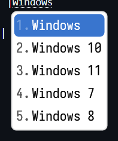
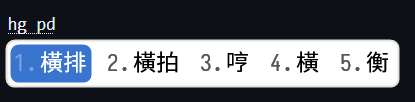
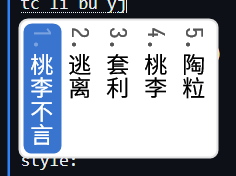
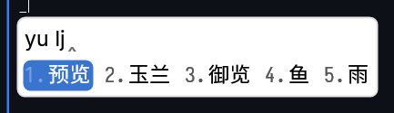
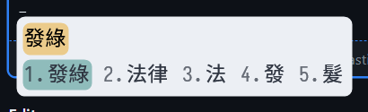
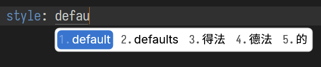
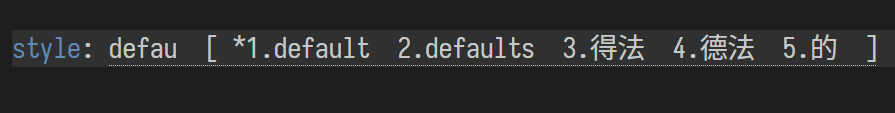
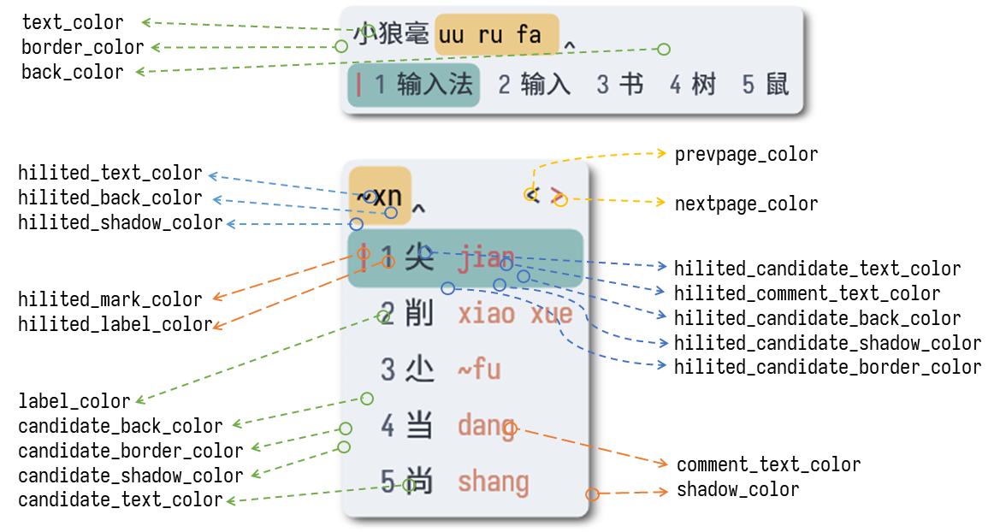

Weasel（小狼毫）是 Rime 输入法引擎的 Windows 平台发行版。您如果需要调整 Rime 的输入方案、快捷键等诸多 Rime 发行版共有的设置，请移步 Rime 主项目 wiki：

- [Rime 定制指南](../wiki/CustomizationGuide.md)

而如果您需要定制 Weasel 的候选窗口布局、字体、颜色等 Weasel 独有的样式或行为，本页面可以提供额外的指导与参考。

## 如何定制

> [!TIP]
>
> 1. 打开小狼毫用户文件夹，找到 `weasel.custom.yaml` 文件，如果没有，则新建一个；
> 2. 按特定规则编辑 `weasel.custom.yaml`，记得保存更改；
> 3. 选择「重新部署」，定制方可生效。

Weasel 的大部分独有行为都由 `weasel.yaml` 文件控制。您可以在 Weasl 安装目录（右键小狼毫图标，选择「程序文件夹」）的 `data` 文件夹中找到一份预置的 `weasel.yaml`。然而直接更改这份文件较为麻烦，并且软件更新会导致更改丢失。

> [!TIP]
> 但是，您可以将此文件复制到小狼毫用户目录下。如此操作后，用户目录下的 `weasel.yaml` 将控制小狼毫此外观样式和行为。注意，复制后的文件 `config_version` 值需要大于等于预置版本的值。

一般推荐以补丁的方式进行自定义。

首先定位到小狼毫用户目录 `%AppData%\Rime`：

- 在开始菜单搜索 `【小狼毫】用户文件夹`，或者
- 右键小狼毫图标，选择 `用户文件夹`

找到 `weasel.custom.yaml` 文件，如果没有，请新建一个。用记事本或代码编辑器打开这份文件，其内容大致如下所示：

```yaml
# weasel.custom.yaml
customization:
  distribution_code_name: Weasel
  distribution_version: 0.15.0.0
  generator: "Weasel::UIStyleSettings"
  modified_time: "Tue Jan  2 16:41:48 2024"
  rime_version: 1.9.0
patch:
  "style/color_scheme": aqua
```

如果该文件由您自行创建，请输入下面一行代码：

```yaml
# weasel.custom.yaml
patch:
```

自定义条目都要写在 `patch` 节点下。但注意，错误的语法会让小狼毫工作异常，乃至于部署失败：如何书写才能被 Rime 认识？核心的规则如下：

```yaml

patch:
  "一级设定项/二级设定项/三级设定项": 新的设定值
  "另一个设定项": 新的设定值
  "再一个设定项": 新的设定值
  "含列表的设定项/+": 与节点合并的设定值
```

更详细、高级的定制方法以及注意事项请参考 [Rime 配置文件](../wiki/Configuration.md#rime-配置文件) 页面和 [定制指南](../wiki/CustomizationGuide.md) 页面。

譬如我希望：

- 修改小狼毫候选窗口的圆角半径为 8，并且
- 设置系统为深色模式时的配色方案为 `aqua`，以及
- 将预置的配色方案 `aqua` 的文字颜色修改为 `0xccaa88 `

其他样式不做修改，那么 `weasel.custom.yaml` 应当为：

```yaml
# weasel.custom.yaml
patch:
  "style/color_theme_dark": aqua
  "style/layout/round_corner": 8
  "preset_color_schemes/aqua/text_color": 0xccaa88
```

又如，我需要同时修改数个 `style` 节点下的条目，但又不想影响其他的设置，我可以这么写：

```yaml
# weasel.custom.yaml
patch:
  style/+:
    comment_font_point: 13
    inline_preedit: true
    label_format: "%s"
    candidate_abbreviate_length: 30
```

修改完毕，并保存后，从菜单选择「重新部署」，才能让定制生效。

> [!TIP]
> 您如果认为自定义没有生效或有异常，可以定位到用户文件夹的 `build` 目录，找到生成的 `weasel.yaml`，检查其是否符合预期。

## Weasel.yaml

Weasel 还有更多可以定制的行为，如下是对每一项条目的具体解释

### 通知及全局 ASCII 模式

```yaml
# weasel.yaml

show_notifications: true
# 也可以使用 list 的设定方式，列表内容为方案中的 options name, 或 schema（作为方案名称显示用）
# 可设定于 weasel.[custom.]yaml，或方案 patch 中：默认调取全局设定，如方案中有专有设定则随方案设定工作，示例如下
# show_notifications:
#   - ascii_mode
#   - ascii_punct
#   - full_shape
#   - simplification
#   - schema

show_notifications_time: 1200
global_ascii: false
```

| 选项                      | 值              | 说明                                           |
| ------------------------- | --------------- | ---------------------------------------------- |
| `show_notifications`      | `true`（开启全部）; `false`（关闭全部）;`list`（方案中的 options name 和 schema ） | 显示状态变化（方案内的开头 option）的通知，部署信息不会受此项影响。 |
| `show_notifications_time` | integer         | 通知显示的时间，单位 ms                        |
| `global_ascii`            | `true`; `false` | 切换为 ascii 模式时，是否影响所有窗口          |

### 样式

`style` 节点下的选项控制小狼毫的各种呈现效果，如候选框位置、圆角、字体、布局等。

#### 配色方案

```yaml
style:
  color_scheme: <scheme_name>
  color_scheme_dark: <scheme_name>
```

在此处指定默认配色方案，以及系统为深色模式时，小狼毫所用的配色方案（Windows 10 1809+ 可用）。

你也可以使用小狼毫「输入法设定」功能指定配色方案。

> [!NOTE] 
> 此处指定的是适用于所有方案的配色，其优先级低于在特定输入方案中定义的 'style/color_scheme'。
> 
> 例如，在 `weasel.custom.yaml` 指定 `"style/color_scheme": google`；同时在 `98wubi.custom.yaml` 中指定 `"style/color_scheme": youtube`。当使用其他方案时，配色为 google，当切换为 98wubi 输入方案时，配色仍将会是 youtube。

#### 字体

```yaml
# weasel.yaml
style:
  font_face: "Microsoft YaHei"
  label_font_face: "Microsoft YaHei" 
  comment_font_face: "Microsoft YaHei"
  font_point: 14
  label_font_point: 14 
  comment_font_point: 14
```

| 选项                 | 值                       | 说明     |
| -------------------- | ------------------------ | -------- |
| `font_face`          | 字体 1,字体 2…           | 全局字体 |
| `label_font_face`    | 字体 1,字体 2…           | 标签字体 |
| `comment_font_face`  | 字体 1,字体 2…           | 注释字体 |
| `font_point`         | integer( `14`, `28` …) | 全局字号 |
| `label_font_point`   | integer                  | 标签字号 |
| `comment_font_point` | integer                  | 注释字号 |

你可以分别指定全局字符，标签字符和注释字符的字体。每个字体条目都支持同时指定多个字体，字体间之间用逗号分隔。当某个字符用首位字体无法呈现时，会顺位使用第二个指定的字体呈现，以此类推。指定字体的格式为：

```
字体甲 [:[起始码位]] [:结束码位] [: 字重] [: 字形] [, 字体乙 ... ]
```

例如：

```yaml
font_face: "Segoe UI Emoji:30:39:Bold, LXGW WenKai, SF Pro, Segoe UI Emoji"
```
元素内容将顺位由：Segoe UI Emoji（仅渲染 `0-9`）-> LXGW WenKai-> SF Pro -> Segoe UI Emoji 呈现，本例子中字重将按 Bold 显示。

字形和字重，只取识别到和第一个有效设定，不能每个字体分别设定，建议字形和字重在第一个字体中设置。

关于字体设定更加详细的解释，可以参看 Wiki 中的 [字体设定](字體設定) 页面。

#### 窗口

```yaml
# weasel.yaml
style:
  fullscreen: false 
  horizontal: false
  vertical_text: false
  # text_orientation: horizontal
  vertical_text_left_to_right: false
  vertical_text_with_wrap: false
  vertical_auto_reverse: false
```

| 选项                          | 值                       | 说明                                           |
| ----------------------------- | ------------------------ | ---------------------------------------------- |
| `fullscreen`                  | `true`; `false`          | 候选窗口全屏显示                               |
| `horizontal`                  | `true`; `false`          | 候选项横排                                     |
| `vertical_text`               | `true`; `false`          | 竖排文本                                       |
| `text_orientation`            | `horizontal`；`vertical` | 文本排列方向，效果和 `vertical_text` 相同      |
| `vertical_text_left_to_right` | `true`; `false`          | 竖排方向是否从左到右                           |
| `vertical_text_with_wrap`     | `true`; `false`          | 文本竖排模式下，自动换行                       |
| `vertical_auto_reverse`       | `true`; `false`          | 文本竖排模式下，候选窗口位于光标上方时倒序排列 |

效果预览：

`horizontal: false`



`horizontal: true`



`vertical_text: true`；`vertical_text_left_to_right: true`



#### 预编辑区

```yaml
# weasel.yaml
style:
  inline_preedit: false
  preedit_type: composition
```

| 选项             | 值                                                           | 说明                   |
| ---------------- | ------------------------------------------------------------ | ---------------------- |
| `inline_preedit` | `true`; `false`                                              | 是否在行内显示预编辑区 |
| `preedit_type`   | `composition`（编码）；`preview`（高亮候选）；`preview_all`（全部候选）| 预编辑区显示内容       |

效果预览：

`inline_preedit: false`；`preedit_type: composition`（默认）



`inline_preedit: false`；`preedit_type: preview`



`inline_preedit: true`；`preedit_type: composition`



`inline_preedit: true`；`preedit_type: preview_all` ; `margin_x: -1`；`margin_y: -1`



#### 其他选项

```yaml
style:
  label_format: "%s"
  mark_text: ""
  ascii_tip_follow_cursor: false
  enhanced_position: false
  display_tray_icon: false
  antialias_mode: default
  candidate_abbreviate_length: 0
  # mouse_hover_ms: 0 # 弃用
  hover_type: none
  paging_on_scroll: true
  click_to_capture: false
```

| 选项                          | 值                                                           | 说明                                                         |
| ----------------------------- | ------------------------------------------------------------ | ------------------------------------------------------------ |
| `label_format`                | string                                                       | 标签字符，例如 `%s.` 的效果为 1. 2. 3…..                     |
| `mark_text`                   | string                                                       | 标记字符，显示在选中的候选标签前，需要在配色方案中指定颜色；如该项为空字符串 "" 而配色方案中 hilited_mark_color 非透明色，则显示 Windows 11 输入法风格标记 |
| `ascii_tip_follow_cursor`     | `true`; `false`                                              | 切换 ASCII 模式时，提示跟随鼠标，而非输入光标                |
| `enhanced_position`           | `true`; `false`                                              | 无法定位候选框时，在窗口左上角显示候选框                     |
| `display_tray_icon`           | `true`; `false`                                              | 托盘显示独立于语言栏的额外图标                               |
| `antialias_mode`              | `default`；`force_dword`；`cleartype`；`grayscale`；`aliased` | 次像素反锯齿设定                                             |
| `candidate_abbreviate_length` | integer                                                      | 候选项略写，超过此数字则用省略号代替。设置为 0 则不启用此功能 |
| ~~`mouse_hover_ms`~~          | ~~integer~~                                                  | ~~已弃用，鼠标悬停选词响应时间（ms），设置为 0 时禁用该功能~~ |
| `hover_type`                  | `none`（无动作）；`hilite`（选中鼠标下的候选）；`semi_hilite`（高亮鼠标下的候选） | 鼠标在候选窗口悬停时的动作                                   |
| `paging_on_scroll`            | `true`; `false`                                              | 在候选窗口上滑动滚轮的行为：true（翻页）；false（选中下一个候选） |
| `click_to_capture`            | `true`; `false`                                              | 鼠标点击候选项，创建截图                                     |

#### 布局

以下选项在 `style/layout:` 中：

```yaml
# weasel.yaml
style:
  layout:
    baseline: 0
    linespacing: 0
    align_type: center
    max_height: 0
    max_width: 0
    min_height: 0
    min_width: 160
    type: horizontal
    border_width: 3
    margin_x: 12
    margin_y: 12
    spacing: 10
    candidate_spacing: 5
    hilite_spacing: 4
    hilite_padding: 2
    # hilite_padding_x: 2
    # hilite_padding_y: 2
    shadow_offset_x: 4
    shadow_offset_y: 4
    shadow_radius: 0
    corner_radius: 4
    round_corner: 4
```

| 选项                                    | 值                                                           | 说明                                                         |
| --------------------------------------- | ------------------------------------------------------------ | ------------------------------------------------------------ |
| `baseline`                              | integer                                                      | 字号百分比，参考 <https://github.com/rime/weasel/pull/1177>  |
| `linespacing`                           | integer                                                      | 字号百分比，参考 <https://github.com/rime/weasel/pull/1177>  |
| `align_type`                            | `top` ; `center` ; `bottom`                                  | 标签、候选文字、注解文字之间的相对对齐方式                   |
| `max_height` & `max_width`              | integer                                                      | 候选框最大高度、宽度。超过设定值会尝试自动折叠，设置为 0 不启用此功能 |
| `min_height` & `min_width`              | integer                                                      | 候选框最小高度、宽度                                         |
| `type`                                  | `horizontal`（横向）；`vertical`（竖直）; `vertical_text`（文本竖直）; `vertical+fullscreen`（竖向全屏）; `horizontal+fullscreen`（横向全拼） | 布局类型；功能近似 style 下的窗口控制选项                    |
| `border_width`                          | integer                                                      | 边框宽度，别名 `border`                                      |
| `margin_x` & `margin_y`                 | integer                                                      | 主体元素和候选框的左右、上下边距，为负值时，不显示候选框     |
| `spacing`                               | integer                                                      | inline_preedit 为 false 时，编码区域和候选区域的间距         |
| `candidate_spacing`                     | integer                                                      | 候选项之间的间距                                             |
| `hilite_spacing`                        | integer                                                      | 候选项和相应标签的间距，候选项与注解文字之间的距离           |
| `hilite_padding`                        | integer                                                      | 高亮区域和内部文字的间距，影响高亮区域大小                   |
| `hilite_padding_x` & `hilite_padding_y` | integer                                                      | 高亮区域和内部文字的左右、上下间距，如无特殊指定则依 hilite_padding 设置 |
| `shadow_radius`                         | integer                                                      | 阴影区域半径，为 0 不显示阴影；需要同时在配色方案中指定非透明的阴影颜色 |
| `shadow_offset_x` & `shadow_offset_y`   | integer                                                      | 阴影绘制的偏离距离                                           |
| `corner_radius`                         | integer                                                      | 候选窗口圆角半径                                             |
| `round_corner`                          | integer                                                      | 候选背景色块圆角半径，别名 `hilited_corner_radius`           |

### 预定义配色方案

```yaml
# weasel.yaml
preset_color_schemes:
  aqua:                                           # 在 style/color_schema 指定的配色方案值
    name: 碧水／Aqua                              # 方案设置中显示的配色名称
    author: 佛振 <chen.sst@gmail.com>             # 配色作者名称
    # color_format: abgr                          # 颜色格式：argb；rgba；abgr（默认）
    text_color: 0x000000                          # 默认文字颜色
    # comment_text_color: 0x000000                # 注释文字颜色
    # label_color: 0x000000                       # 标签文字颜色
    back_color: 0xeceeee                          # 候选窗背景色
    shadow_color: 0x00000000                      # 候选窗阴影色
    border_color: 0xe0e0e0                        # 候选窗边框颜色
    hilited_text_color: 0x000000                  # 编码文字颜色
    hilited_back_color: 0xd4d4d4                  # 编码背景颜色
    hilited_shadow_color: 0x00000000              # 编码背景块阴影颜色
    hilited_candidate_text_color: 0xffffff        # 高亮候选文字颜色
    hilited_candidate_back_color: 0xfa3a0a        # 高亮候选背景颜色
    hilited_candidate_shadow_color: 0x00000000    # 高亮候选背景块阴影颜色
    # hilited_candidate_border_color: 0xe0e0e0    # 高亮候选边框颜色
    # hilited_label_color: 0x000000               # 高亮候选的标签颜色
    # hilited_mark_color: 0x000000                # 高亮候选前的标记颜色
    # hilited_comment_text_color: 0x000000        # 高亮候选的注释颜色
    candidate_text_color: 0x000000                # 非高亮候选文字颜色
    candidate_back_color: 0xeceeee                # 非高亮候选背景颜色
    candidate_shadow_color: 0x00000000            # 非高亮候选背景块阴影颜色
    # candidate_border_color: 0xe0e0e0            # 非高亮候选的边框颜色
    # nextpage_color: 0x00000000                  # inline_preedit: false 翻页箭头颜色：下一页；不设置则不显示箭头
    # prevpage_color: 0x00000000                  # inline_preedit: false 翻页箭头颜色：上一页；不设置则不显示箭头
```

`preset_color_schemes` 节点下的 `scheme_name` 是该配色方案的真实名称，用于配置文件中指定方案。`scheme_name` 节点下的 `name` 为该方案的显示名称，用在小狼毫「输入法设定」界面中。

各个选项的含义图示如下：



您也可以使用在线配色设计：

- [RIME 西米](https://fxliang.github.io/RimeSeeMe/)
- [润笔](https://pdog18.github.io/rime-soak/#/theme)

关于配色方案的详细说明，请参考 [定制小狼毫配色](定制小狼毫配色) 页面。

### 应用设置

```yaml
# weasel.yaml
app_options:
  cmd.exe:
    ascii_mode: true
  conhost.exe:
    ascii_mode: true
  firefox.exe:
    inline_preedit: true
  gvim.exe:
    ascii_mode: true
    vim_mode: true
```

`app_options` 中写进程名，Weasel 15.0 及之前版本须小写，PR # 1049 合并后释出的版本大小写不敏感。

小狼毫支持的三个选项的功能为：

| 选项              | 值              | 说明                                   |
| ----------------- | --------------- | -------------------------------------- |
| `ascii_mode`      | `true`; `false` | 英文模式                               |
| `inline_preedit ` | `true`; `false` | 行内显示预编辑区                       |
| `vim_mode`        | `true`; `false` | vim 模式, Esc <C-c> <C-[> 切换到 ascii |