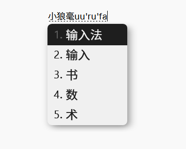
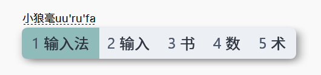
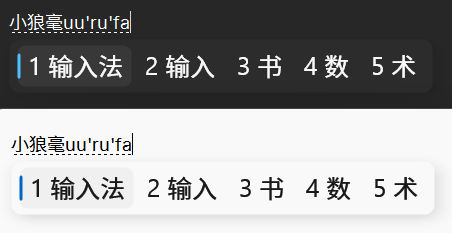

# 示例

## 竖排 天圆地方



```yaml
# weasel.custom.yaml
patch:
  style/+:
    inline_preedit: true
    font_point: 15
    label_font_point: 13
    comment_font_point: 15
    horizontal: false
    layout:
      min_width: 160
      margin_x: 12
      margin_y: 2
      candidate_spacing: 2
      hilite_spacing: 6
      hilite_padding: 2
      hilite_padding_x: 12
      shadow_radius: 8
      corner_radius: 8
      shadow_offset_x: 5
      shadow_offset_y: 5
```

## 横排 天圆地方



```yaml
# weasel.custom.yaml
patch:
  style/+:
    label_format: "%s"
    inline_preedit: true
    font_point: 15
    label_font_point: 15
    comment_font_point: 14
    horizontal: true
    layout:
      max_width: 1200
      min_width: 10
      margin_x: 15
      margin_y: 6
      hilite_spacing: 6
      hilite_padding_y: 6
      hilite_padding_x: 15
      shadow_radius: 8
      corner_radius: 8
      round_corner: 8
      shadow_offset_x: 5
      shadow_offset_y: 5
```
## Windows 11 风格



```yaml
# weasel.custom.yaml
patch:
  style/+:
    label_format: "%s"
    inline_preedit: true
    font_point: 15
    label_font_point: 15
    comment_font_point: 15
    horizontal: true
    color_scheme: win11light
    color_scheme_dark: win11dark
    layout:
      min_width: 10
      margin_x: 16
      margin_y: 8
      border: 2
      candidate_spacing: 22
      hilite_spacing: 6
      hilite_padding: 2
      hilite_padding_x: 8
      corner_radius: 10
      round_corner: 8
      shadow_radius: 8
  preset_color_schemes/+:
    win11light:
      name: " Win11浅色 / Win11light"
      text_color: 0x191919
      label_color: 0x191919
      hilited_label_color: 0x191919
      back_color: 0xf9f9f9
      border_color: 0x009e5a00
      hilited_mark_color: 0xc06700
      hilited_candidate_back_color: 0xf0f0f0
      shadow_color: 0x20000000
    win11dark:
      name: "Win11暗色 / Win11Dark"
      text_color: 0xf9f9f9
      label_color: 0xf9f9f9
      back_color: 0x2C2C2C
      hilited_label_color: 0xf9f9f9
      border_color: 0x002C2C2C
      hilited_mark_color: 0xFFC24C
      hilited_candidate_back_color: 0x383838
      shadow_color: 0x20000000
```

## 微信输入法风格


```yaml
# weasel.custom.yaml
patch:
  style/+:
    label_format: "%s"
    inline_preedit: true
    font_point: 15
    label_font_point: 15
    comment_font_point: 13
    horizontal: true
    color_scheme: wechat
    layout:
      max_height: 0
      max_width: 1200
      min_width: 10
      margin_x: 10
      margin_y: 8
      candidate_spacing: 24
      hilite_spacing: 6
      hilite_padding: 3
      hilite_padding_x: 5
      corner_radius: 8
      round_corner: 8
      shadow_radius: 4
  preset_color_schemes/+:
    wechat:
      name: "微信／Wechat"
      text_color: 0x424242
      label_color: 0x999999
      back_color: 0xFFFFFF
      border_color: 0xFFFFFF
      comment_text_color: 0x999999
      candidate_text_color: 0x3c3c3c
      hilited_comment_text_color: 0xFFFFFF
      hilited_back_color: 0x79af22
      hilited_text_color: 0xFFFFFF
      hilited_label_color: 0xFFFFFF
      hilited_candidate_back_color: 0x79af22
      shadow_color: 0x20000000
```