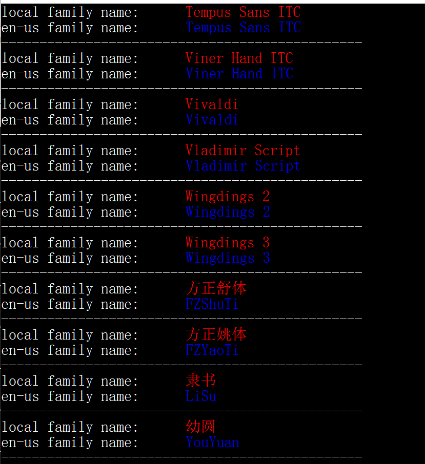

# 字體設定

從0.15.0開始，小狼毫支持標籤字體、註解字體及字號，支持自定義字體回退順序、回退範圍、字體字重、字體字形

## 新增選項參數
* 標籤字體及字號

`style/label_font_face: string`

`style/label_font_point: int`

* 註解字體

`style/comment_font_face: string`

`style/label_font_point: int`

## 字體（家族）名字 Family Name

font_face/label_font_face/comment_font_face中選擇使用的是字體家族名字（family name),這個信息通常可以在系統自帶的記事本軟件的字體設定界面的字符中獲取。需要注意的是，有部分製作不佳的字體，字體信息上會有一些問題，可能會發生設置了family name但是並不能正確顯示的情況，要注意甄別。另外，[這個](https://github.com/fxliang/FontEnumeration/releases/tag/0.0.1)是一個在[微軟例程](https://github.com/microsoft/Windows-classic-samples/tree/main/Samples/Win7Samples/multimedia/DirectWrite/FontEnumeration)修改而來的一個字體家族信息枚舉小工具，可以方便的看到系統中全部字體的本地化family name 和英文family name,可以一試


## 字體設定組成

font_face設定可以由若干個字體設定組依次排列組成，字體設定組之間使用ASCII逗號分隔且逗號前後的空白不影響解析結果可放心添加方便查閱；

字體回退順序按字體設定的順序從前往後依次回退

每個字體設定組主要包括字體（家族）名稱，**字體回退作用區間起點**，**字體回退作用區間終點**組成，其中 字體回退作用區間起點和字體回退作用區間終點爲可選項；另外第一個字體設定組可按需添加字形**風格設定**、**字重設定**。

`字體1 [: [起點]] [: 終點] [: 字重] [: 字形 ] [,  字體2 ... ] `

基本規則如下：
* 字體（家族）名稱必需置於字體設定組最前
* 字體設定組內的的元素使用ASCII冒號分隔，分隔籤前後的空白不影響解析
* 如需設置字體回退區間使用十六進制數值定義， 如`Segoe UI Emoji : 30 : 39` 表示使用Segoe UI Emoji來繪製 字符0~9。其中30和39爲十六進制數。
* 第一個設定組內，字重和字形設定只要在字體名稱後方即可，順序不論。

## 字體回退作用區間

使用`start_code_point`和`end_code_point`表示起點和終點，則可有以下一些設定形式

定義起點終點   `fontname : start_code_point : end_code_point`

只定義起點     `fontname : start_code_point`

只定義終點     `fontname : : end_code_point`

## 字重設定
在您選用的字體家族支持的前提下，受支持的字重有以下這些可選，大小寫無感，normal是可以不用特殊標註，爲默認值。

thin extra_light ultra_light light semi_light medium demi_bold semi_bold bold extra_bold ultra_bold black heavy extra_black ultra_black normal

## 字形風格設定
支持的字形風格有以下三種，默認normal無需特殊標識

italic oblique normal

## 例子解析

```yaml
style/font_face: "LXGW Wenkai Narrow:7c:7c, Segoe UI Emoji:30:39, Segoe UI Emoji:23:23, Segoe UI Emoji:2a:2a, Segoe UI Emoji:fe0f:fe0f, Segoe UI Emoji:20e3:20e3, Arial:600:6ff, WB091:E000:E200，LXGW Wenkai Narrow, Segoe UI Emoji, Noto Color Emoji SVG"
```
這個可能是一個足夠複雜的例，基本達成的需求如下 
1. Emoji字符主要使用Segoe UI Emoji繪製，未包含的部分Emoji字形用Noto Color Emoji SVG 來支援。
`Segoe UI Emoji:30:39, Segoe UI Emoji:23:23, Segoe UI Emoji:2a:2a, Segoe UI Emoji:fe0f:fe0f, Segoe UI Emoji:20e3:20e3`
 實現ASCII的數字區、#、*、Emoji Keycap使用到的fe0f和20e3均使用Segoe UI Emoji繪製
2. ` Arial:600:6ff` 確保阿拉伯語字形顯示正常
3. ` WB091:E000:E200` 定義私有區字體
4. 主字體是LXGW Wenkai Narrow，爲了使mark_text `|` 顯示和主字體協調，定義`LXGW Wenkai Narrow:7c:7c`最前，LXGW Wenkai Narrow主字體設定上述分組設定後，保證除已分配的碼點外，均使用主字體繪製
5. ` Segoe UI Emoji, Noto Color Emoji SVG, ` Emoji字符回退，先Segoe UI Emoji，後Noto Color Emoji SVG


 

待續
