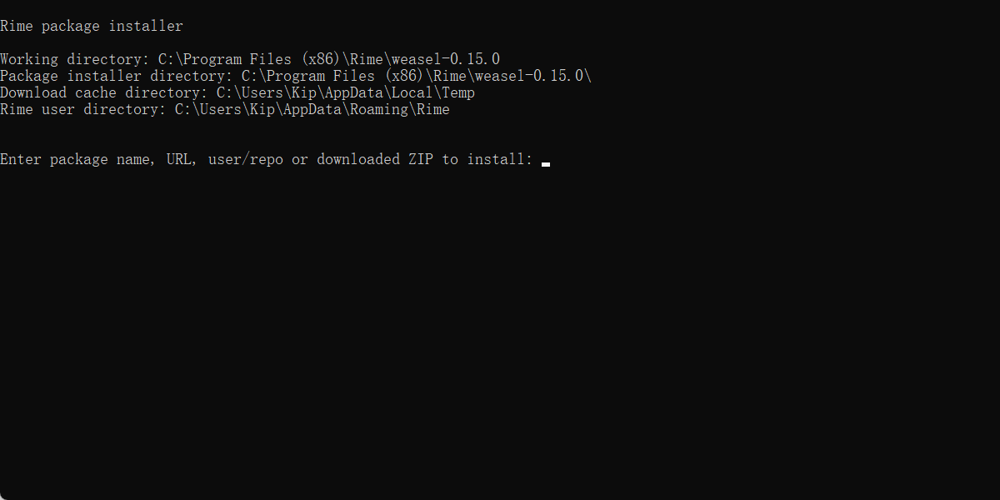

除了手动复制、粘贴方案文件外，您也可以使用小狼毫内置的方案安装脚本获取方案。

右键小狼毫托盘图标，选择「输入法设定」，点击位于窗口右下角的「获取更多方案」，便可以从 GitHub 获取其他输入方案。

## 使用方法

在上图的弹窗中，直接输入格式为 `<username>/<repo>` 的方案名，小狼毫将尝试从 GitHub 下载该方案的默认分支，并自动复制到用户目录。

> [!IMPORTANT]  
> 根据脚本设计，这种使用方式将只会复制远程库中，以特定后缀名结束的文件。lua 脚本等文件并不会自动更新到用户目录。
>
> 如果这些文件是必要的，您可能需要手动复制。或者参考下一节预先安装完整版的 plum。

例如，可以输入 `rime/stroke` 获取五笔画方案，输入 `lotem/rime-octagram-data` 获取语法模型配置文件。

## plum

您如果需要使用 plum 提供的更高级的语法，例如，通过配方（recipe）更新部分文件，则需要预先安装完整版的 plum。

首先，您需要自行通过 [Git 官网](https://git-scm.com/download/win) 或者包管理器，下载并安装 Git for Windows。注意勾选将 git.exe 加入环境变量的相关选项。

然后，在「获取更多方案」提供的弹窗中，输入 `git`，此时应当提醒 `Found git`。这表明 Git 已经成功安装。

最后，输入 `plum`，这时脚本会尝试将完整版 plum 克隆到本地。

> [!NOTE]  
> 在最后一步中，您如果看到 `Error downloading rime-install` 错误信息，请再次输入 `plum`。

视频演示

assets/76689045/6e9a25d2-62ba-41bd-b2cd-bfb1b51f7ea3.png

此后，完整版 plum 将成为默认的输入方案下载器。您便可以在弹出的窗口输入 plum 支持的各种配方语法以下载相应方案。具体可以参考 [plum 文档](https://github.com/rime/plum?tab=readme-ov-file#advanced-usage)。

例如，输入 `lotem/rime-octagram-data lotem/rime-octagram-data@hant` 获取简体语法模型，输入 `lotem/rime-octagram-data:customize:schema=luna_pinyin,model=hant` 配置朙月拼音使用语法模型。

此功能由东风破 [/plum/](https://github.com/rime/plum) 提供，默认情况下，plum 将被克隆到 AppData/Roaming 目录的 plum 文件夹。
更多信息或者问题，请移步 [plum 项目](https://github.com/rime/plum)。